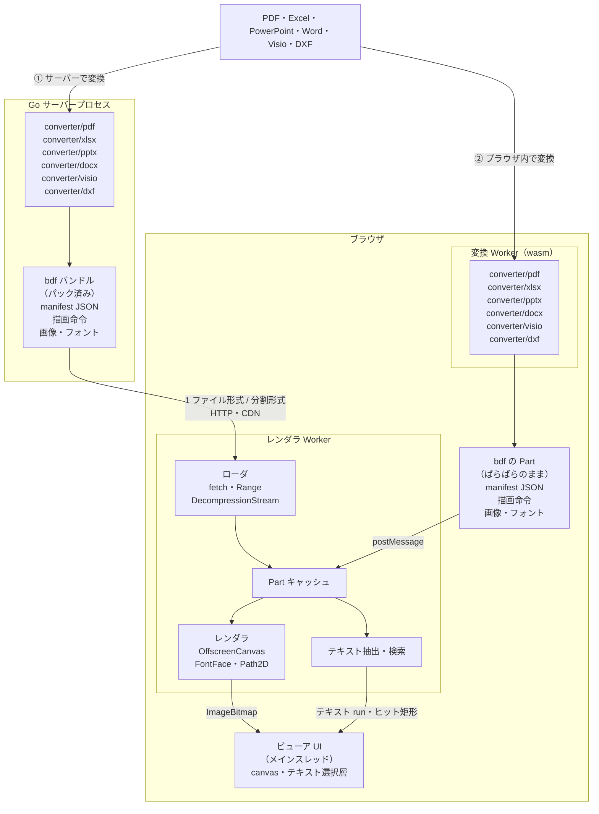

# bdf

[English](README.md) | 日本語

**bdf**（Browser-specific Document Format）は、ブラウザの Canvas 2D にそのまま描画できる、プレビュー用の文書フォーマット（ドラフト）です。

Office 系のファイル（PDF、Excel、PowerPoint、Word、Visio）と CAD の図面（DXF）を bdf に変換し、Web Worker 内で動くレンダラで描画します。ブラウザが標準 API で代替できるもの（フォントラスタライズ、画像デコード、圧縮）はブラウザに任せ、デコーダを最小にします。

## 処理の流れ



経路は 2 つあります。どちらも同じ bdf の Part を作り、同じレンダラで描画します。

1. **サーバーで変換**: Go のサーバープロセス内で `converter/pdf`、`converter/pptx`、`converter/xlsx` などのパッケージが元ファイルを変換し、manifest・描画命令・画像・フォントをパックした **bdf バンドル**にします。バンドルは 1 ファイル形式（先頭からのストリーミング読み、または Range による Part 単位の取得）か、オブジェクトストレージや CDN にそのまま置ける分割形式で配信します。ブラウザでは Worker 内のレンダラが必要な Part だけを読み込んで `OffscreenCanvas` に描画し、メインスレッドは受け取ったビットマップと透明なテキスト層を配置するだけです。
2. **ブラウザ内で変換**: 同じ変換パッケージを wasm にしたものが Worker で動き、ユーザーが開いたファイルを bdf の Part（描画命令、画像、フォント）に分解します。Part はバンドルにパックせず、ばらばらのままレンダラに渡すので、変換から描画までがブラウザ内で完結し、ファイルは外に出ません。

## 特徴

- 固定サイズページ（スライド）、無限平面（シート）、ページ分割かつ連続表示可能な文書（ワープロ。ページを持たずに 1 枚の長い面としてレイアウトした View も持てる）の 3 モデル
- 命令セットは `CanvasRenderingContext2D` に 1:1 対応
- `DecompressionStream` で展開、Worker + `OffscreenCanvas` で描画
- 内容アドレスの Part によりマスターや繰り返し部品を自動共有
- テキスト索引 Part と Worker 内の全文検索（行またぎ、NFKC・かな正規化、ヒット矩形）
- 透明 DOM のテキスト選択層とコピー（空白・改行は MARK 境界から復元、ページまたぎ、連続モード対応）
- 読み上げ可能なテキスト層: 構造 MARK の見出し・リスト・表・代替テキスト付きの図・リンク・言語をスクリーンリーダーに伝える（タグ付き PDF、PowerPoint と Word の構造、Excel のセルと表の見出しを変換）
- 1 ファイル形式と分割ファイル形式を相互変換可能（1 ファイル形式はマジック `bdf\0` で始まる）
- manifest に Dublin Core のメタデータ（題名・作成者・主題・言語・作成日時など）を持てる。PDF の文書情報、PowerPoint・Excel・Word のコアプロパティ、Visio の文書プロパティから引き継ぐ
- パスワードで保護された入力（読み取りパスワード付きの Office 文書、ユーザーパスワード付きの PDF）はパスワードで開いて変換し、bdf を同じパスワードで暗号化する。Part ごとに封印する（AES-256-GCM）ので Range 取得や分割形式はそのまま使える。ビューアは WebCrypto で復号し、サーバーはパスワードを保存しない（spec §3.5）

変換は `bdf generate` サブコマンドで行い、入力の形式（PDF / PowerPoint / Excel / Word / Visio / DXF / Windows メタファイル）は中身から判別します。

- **PDF**（`converter/pdf`）: 埋め込みフォント（TrueType、CFF、OpenType、Type1）を使うグリフだけの WOFF2 に組み直し（OS/2 の埋め込み許諾 `fsType` を確認し、著作権表示は引き継ぐ）、フォーム XObject を共有オブジェクトに、テキストを検索可能な run に変換し、各ページ先頭の共通部分（マスター）を共有 Object に切り出します。詳細は design.md の §3.1。
- **PowerPoint .pptx**（`converter/pptx`）: DrawingML を直接描画します。スライドマスターとレイアウトの図形はスライド間で共有されるレイヤー Object になり、プリセット図形は ECMA-376 の図形定義式から、テキストは変換側で折り返し（和文の禁則・縦書き・箇条書き・段落書式）、表・グラフ・SmartArt・EMF/WMF の図も描きます。レイアウトに使ったフォントはサブセットの WOFF2 にして埋め込むので、閲覧環境のフォントに依存しません。詳細は design.md の §3.4。
- **Excel .xlsx**（`converter/xlsx`）: ワークシートごとにシート View にし、セルを変換側でレイアウトしてタイルに描きます。表示形式（日付・和暦・分数・会計）、フォントとリッチテキスト、塗り、罫線、配置（和文の禁則付きの折り返し、空きセルへのはみ出し、回転、縮小して全体を表示）、セル結合、条件付き書式（カラースケール・データバー・アイコンセット・数式のルール）、テーブルとそのスタイルを扱い、画像・図形・グラフは 1 回だけ描いた Object を重なるタイルから使います。グラフシートはページになります。列幅と行の高さは Excel の規則に従い、ウィンドウ枠の固定と枠線は manifest に書きます。詳細は design.md の §3.6。
- **Visio .vsdx / .vdx**（`converter/visio`）: Visio 2013 以降のパッケージ（.vsdx、.vsdm、.vstx）と Visio 2003〜2010 の XML 図面（.vdx）を、同じ ShapeSheet のモデルに読みます。図形はマスターとスタイルから継承し、動的テーマが決めるセルはテーマと図形のクイックスタイルから解決します。ジオメトリの各行、塗りのパターン、グラデーション、線種、45 種の矢印を描き、背景ページはページ間で共有される背景レイヤーにします。テキストは PowerPoint と同じ DrawingML のテキストエンジンでレイアウトし、フォントをサブセットの WOFF2 にして埋め込みます。バイナリの .vsd は読みません。詳細は design.md の §3.8。
- **Word .docx**（`converter/docx`）: Word がファイルを開くたびに行っている組版を変換側で行います。行分割（和文の禁則とアキ、タブとリーダー、両端揃え、文書グリッド）、箇条書きと段落番号、表（表スタイル、セルの結合、ページをまたぐ行の分割、見出し行の繰り返し）、文字列の折り返しを伴う浮動する図とテキストボックス、段組み、セクション、ページ番号付きのヘッダー・フッター、脚注、縦書き（漢字・仮名の正立、縦書き用の句読点、欧文や表の回転）を扱います。View は 2 つで、紙面のページ（ヘッダー・本文・フッターのレイヤーを持つ flow View）と、ページを持たずに本文の幅でもう一度レイアウトした 1 枚の長い面（Word の下書き・Web レイアウト表示にあたる scroll View）です。図は PowerPoint と同じ DrawingML の描画で描き、フォントも同じく埋め込みます。詳細は design.md の §3.9。
- **AutoCAD .dxf**（`converter/dxf`）: テキスト形式とバイナリ形式の DXF（R12〜2018）を読みます（仕様が公開されていない DWG は読みません）。モデル空間は図面に合わせた 1 ページにして CAD ソフトと同じ暗い背景に、ペーパー空間のレイアウトはそれぞれ用紙の大きさの 1 ページにして、ビューポートがその縮尺でモデル空間を映します。画層・色・線種・線の太さはプロッタが描くとおりに解決し、膨らみと幅のあるポリライン、スプライン（厳密なベジェ曲線として）、ハッチング（模様・島・グラデーション）、属性付きのブロックとその配列、寸法、引出線とマルチ引出線、1 行と複数行の文字（書式コード、和文の禁則付きの折り返し、分数）を描きます。SHX フォントはゴシック体の、ビッグフォントは和文のフォントで代用し、使ったフォントをサブセットの WOFF2 にして埋め込みます。古い図面の文字列はそのコードページ（Shift_JIS など）で読みます。詳細は design.md の §3.10。
- **Windows メタファイル .emf / .wmf**（`converter/emf`）: 図の大きさの 1 ページにし、メタファイルの記録を再生して描きます（Office 文書の中の EMF/WMF の図を描くのと同じ再生処理）。テキストは PowerPoint と同じくレイアウトしてフォントを埋め込みます。

入力形式は static plugin 方式です。各変換器のパッケージは import されたときに `converter` パッケージへ自分の形式を登録するので、プログラムはリンクしたパッケージの形式だけを扱えます。

```go
import (
	"github.com/shibukawa/bdf/converter"
	_ "github.com/shibukawa/bdf/converter/pdf" // すべての形式なら converter/all
)

res, err := converter.ConvertFile("in.pdf", "", &converter.Options{}) // "" で形式を判別
```

パスワードで保護された入力は `Options.Password` で開く。パスワードが必要だったことを `res.Protected` が示したら、同じパスワードで文書を暗号化する。

```go
res, err := converter.ConvertFile("in.pptx", "", &converter.Options{Password: password})
if err != nil {
	return err // converter.ErrPasswordRequired / ErrWrongPassword ならパスワードを聞く（CheckPassword は変換せずに確かめる）
}
if res.Protected {
	if res.Doc.Lock, err = bdf.NewPasswordLock(password, 0); err != nil { // 0: PBKDF2 の既定の反復回数
		return err
	}
}
```

## ドキュメント

- [docs/spec.md](docs/spec.md) — フォーマット仕様ドラフト
- [docs/design.md](docs/design.md) — 設計判断の理由と実装方針

## 構成

| 場所 | 内容 |
|---|---|
| `*.go`, `cmd/bdf` | Go のエンコーダ・デコーダ・コンテナ I/O と CLI（`bdf generate` で変換） |
| `fixture/` | サンプル文書の生成（埋め込みフォント付き） |
| `imgconv/` | 画像の格納方針（そのまま / WebP に変換）。純 Go の libwebp を同梱 |
| `converter/` | 入力形式の登録と共通のオプション、形式の判別、ページ指定 |
| `converter/pdf` | PDF → BDF 変換器 |
| `converter/pptx` | PowerPoint (.pptx) → BDF 変換器 |
| `converter/xlsx` | Excel (.xlsx) → BDF 変換器 |
| `converter/docx` | Word (.docx) → BDF 変換器 |
| `converter/visio` | Visio (.vsdx, .vdx) → BDF 変換器 |
| `converter/dxf` | AutoCAD DXF → BDF 変換器 |
| `converter/emf` | Windows メタファイル (.emf, .wmf) → BDF 変換器 |
| `converter/all` | すべての入力形式を登録する（副作用のために import する） |
| `converter/internal/` | フォントの探索・計測・サブセット化（`fontdb`）、TrueType/OpenType の読み書き（`sfnt`）。Office 系の変換器で共有するもの: OOXML のパッケージと XML（`ooxml`）、DrawingML の図形・テキスト・表・グラフ（`ooxml/drawingml`）、テキストレイアウト用のフォント選択・計測・埋め込み（`fontset`）、組み立て中の Object（`canvas`）、EMF/WMF の再生（`metafile`）、CAD 図面のページへの描画（`cad`）、行分割の規則（`linebreak`）、複合ファイル（`cfb`）とパスワード付き Office 文書の復号（`offcrypto`） |
| `woff2/` | TrueType/OpenType → WOFF2（glyf 変換と Brotli） |
| `packages/core` | `@bdf/core`: TypeScript のデコーダ、コンテナ読み込み、テキスト抽出 |
| `packages/render` | `@bdf/render`: Canvas レンダラ、ページ/連続/シート描画（scroll View は連続描画）、Worker |
| `examples/viewer` | デモビューア |
| `testdata/` | 生成済みサンプルと golden 画像 |

## 使い方

```sh
# Go: テストと CLI
go test ./...
go run ./cmd/bdf demo out.bdf        # サンプル文書を生成
go run ./cmd/bdf ls out.bdf          # Part 一覧
go run ./cmd/bdf disasm out.bdf <hash>
go run ./cmd/bdf split out.bdf out/  # 分割形式へ

# PDF / PowerPoint / Excel / Word / Visio / DXF / メタファイル → BDF（形式は中身から判別。-format pdf|pptx|xlsx|docx|visio|dxf|emf で指定も可）
go run ./cmd/bdf generate -h                  # フラグと、入力形式ごとの -param オプションの一覧
go run ./cmd/bdf generate in.pdf out.bdf      # 1 ファイル形式
go run ./cmd/bdf generate in.pptx out/        # 分割形式
go run ./cmd/bdf generate -pages 1-3 in.pptx out.bdf   # ページ（スライド、シート）を選ぶ
go run ./cmd/bdf generate -images keep in.pdf out.bdf  # 画像を変換しない
go run ./cmd/bdf generate -dc creator=Alice -dc language=ja in.pdf out.bdf  # Dublin Core の要素を上書き（-dc 要素名= で削除）
go run ./cmd/bdf generate -kind flow in.pdf out.bdf    # PDF: flow View にする
go run ./cmd/bdf generate -no-share in.pdf out.bdf     # PDF: ページ共通の先頭部分（マスター）を共有 Object にしない
go run ./cmd/bdf generate -font-dir fonts/ in.pptx out.bdf         # PowerPoint, Excel, Word: フォントを探すディレクトリを追加
go run ./cmd/bdf generate -fonts system in.pptx out.bdf            # PowerPoint, Excel, Word: フォントを埋め込まず名前で参照
go run ./cmd/bdf generate -hidden in.pptx out.bdf                  # PowerPoint, Excel: 非表示のスライドやシートも含める（-param hidden=true と同じ）
go run ./cmd/bdf generate in.xlsx out.bdf                          # Excel ブック: ワークシートごとにシート View
go run ./cmd/bdf generate in.docx out.bdf                          # Word: 紙面のページと scroll View
go run ./cmd/bdf generate -param views=pages in.docx out.bdf       # Word: ページだけ（views=scroll なら scroll View だけ）
go run ./cmd/bdf generate in.vsdx out.bdf                          # Visio（.vsdx / .vdx）: 前景ページごとに 1 ページ
go run ./cmd/bdf generate in.dxf out.bdf                           # DXF: モデル空間とレイアウトごとに 1 ページの View
go run ./cmd/bdf generate -param views=model in.dxf out.bdf       # DXF: モデル空間だけ（views=layouts でレイアウトだけ）
go run ./cmd/bdf generate -param background=light in.dxf out.bdf  # DXF: モデル空間を暗い背景ではなく白い紙に描く
go run ./cmd/bdf generate in.emf out.bdf                           # Windows メタファイル（.emf / .wmf）を 1 ページに
go run ./cmd/bdf generate -password-file pw.txt in.pptx out.bdf    # パスワード付きの入力（- で標準入力、既定は $BDF_PASSWORD）。out.bdf は同じパスワードで暗号化される
go run ./cmd/bdf generate -encrypt never in.pdf out.bdf            # -encrypt auto（既定: 入力にパスワードが要るとき）/ always / never
BDF_PASSWORD=… go run ./cmd/bdf ls out.bdf                         # ls・manifest・disasm・extract は $BDF_PASSWORD で暗号化した文書を読む
BDF_PASSWORD=… go run ./cmd/bdf encrypt in.bdf out.bdf             # 既存の bdf を暗号化（decrypt で解除）。split と join はパスワードなしで使える
go run ./cmd/bdf generate -no-woff2 in.pdf out.bdf     # フォントを WOFF2 にせず TTF/OTF のまま格納
go run ./cmd/bdf generate -ignore-fstype in.pdf out.bdf # fsType が埋め込みやサブセット化を禁じるフォントも埋め込む（権利がある場合のみ）
go build -tags bdf_noconv ./...                    # コーデック（WebP、WOFF2 の Brotli）を含めないビルド（ブラウザ向け）
GOEXPERIMENT=simd go build ./...                   # Go 1.27 amd64/arm64: SIMD 版コーデック（amd64 は AVX2 必須）

# TypeScript: ビルドとテスト
npm ci
npm test                             # デコーダのテスト（Node）
npm run test:golden                  # Chromium で描画して golden 画像と比較
npm run test:golden:update           # golden 画像を更新
npm run testdata                     # testdata/ を再生成（Go が必要）
npm run test:pptx:gen                # PowerPoint のテスト用デッキを再生成（python-pptx と msoffcrypto-tool が必要）
npm run test:xlsx:gen                # Excel のテスト用ブックを再生成（openpyxl が必要）
npm run test:docx:gen                # Word のテスト用文書を再生成
npm run test:visio:gen               # Visio のテスト用図面を再生成
npm run test:dxf:gen                 # DXF のテスト用図面を再生成（要 ezdxf）
node test/render.mjs out.bdf pngdir/  # 任意の .bdf を Chromium で PNG に描画（シートは左上の最大 4096 px 四方）

# デモビューア
npm run demo                         # http://127.0.0.1:8765/examples/viewer/.out/
```

Go は 1.27 以上が必要です。golden テストは `playwright-core`（固定バージョン。golden 画像はその Chromium ビルドの headless shell で描いたもの）を使います。`npx playwright-core install chromium` で入れるか、同じビルドの headless shell を `CHROMIUM_PATH` で指定してください。
