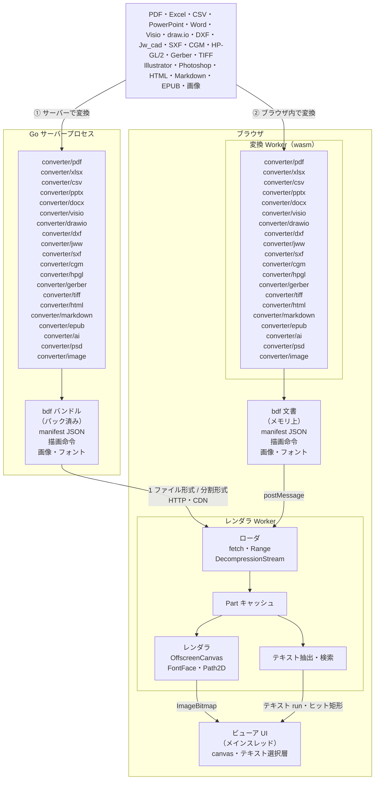

# bdf

[English](README.md) | 日本語

**bdf**（Browser-specific Document Format）は、ブラウザの Canvas 2D にそのまま描画できる、プレビュー用の文書フォーマット（ドラフト）です。

Office 系のファイル（PDF、Excel、PowerPoint、Word、Visio）や draw.io の図、CAD の図面とプロットファイル（DXF、Jw_cad、SXF、CGM、HP-GL/2）、プリント基板の製造データ（Gerber、Excellon）、スキャンや FAX の TIFF 画像、デザインのファイル（Illustrator、Photoshop）、HTML のページ、Markdown の文書、EPUB の本、ブラウザがそのまま表示できる画像を bdf に変換し、Web Worker 内で動くレンダラで描画します。ブラウザが標準 API で代替できるもの（フォントラスタライズ、画像デコード、圧縮）はブラウザに任せ、デコーダを最小にします。

**デモ**: <https://shibukawa.github.io/bdf/>。PDF、Word、PowerPoint、Excel、CSV、Visio のファイル、draw.io の図、DXF・Jw_cad・SXF・CGM の図面、HP-GL/2 のプロットファイル、プリント基板の Gerber・Excellon のファイル（1 つずつでも、ZIP にまとめても）、Illustrator や Photoshop のファイル、Windows メタファイル、HTML のページ、Markdown の文書、EPUB の本や画像をページにドロップすると、ブラウザ内で bdf に変換して描画します（ファイルはアップロードされません）。PDF は変換できたページから、表示中のページを優先して描画します。ドキュメントも <https://shibukawa.github.io/bdf/docs/> で読めます。

## Why bdf

- **オフィススイートを動かさなくてよい**: Office のファイルをブラウザでプレビューするには、サーバーで LibreOffice や OpenOffice をヘッドレスで動かして PDF にするのが定番です。これはインストールだけで 1 GB を超え、プロセスの起動・維持・隔離も必要です。bdf の変換器は cgo も外部プログラムも使わない Go のパッケージで、PDF、Word、PowerPoint、Excel、CSV、Visio、draw.io、DXF、Jw_cad、SXF、CGM、HP-GL/2、Gerber、Excellon、TIFF、Illustrator、Photoshop、メタファイル、HTML、Markdown、EPUB を 1 つのバイナリで変換します。同じコードを WebAssembly にすればブラウザの中でも変換でき（PDF 用が gzip で約 7 MB、Office 系・draw.io・DXF 用が約 5.5 MB）、ファイルをアップロードする必要すらありません。
- **内容に合った形で見せる**: PDF はすべてを紙に切り分けます。スプレッドシートを印刷したページでは、横に長い表がページをまたいで分断されて行を追えず、目当てのセルも見つけにくくなります。固定した見出しや枠線は消え、ブックの中で切り替えていたシートは一続きのページになります。Word の文書もページ単位でしか読めません。bdf は内容の種類ごとにレイアウトのモデルを持ちます。スライド・図面・PDF には固定サイズのページ、ワークシートにはシートごとの無限平面（タイルで描画し、ウィンドウ枠の固定、行・列見出し、枠線つき）、ワープロ文書にはページでも一続きのスクロールでも読めるフローと、ページなしで 1 本の長い列に組み直した表示を用意しています。Illustrator と Photoshop のアートボードはページになります。ブックのシート、draw.io の図のページ、DXF のモデル空間とレイアウト、プリント基板の表・裏と各層はそれぞれ 1 つの表示になり、ビューアのタブで切り替えます。
- **ブラウザ表示に特化している**: 命令セットは Canvas 2D と 1 対 1 に対応します。フォントは `FontFace` に渡す WOFF2、画像はブラウザがデコードできる形式で、Part の圧縮は `DecompressionStream` で展開できる形式です。pdf.js のような PDF ビューアが数万行かけて実装しているフォントのラスタライズ、画像のデコード、展開はブラウザに任せ、bdf のデコーダとレンダラは TypeScript で約 3,400 行です（レンダラの Worker は gzip で 21 KB）。描画は Worker の `OffscreenCanvas` で行い、メインスレッドはビットマップを置くだけです。Part は内容アドレスなので、マスターや繰り返し現れる要素は 1 度だけ格納され、ビューアは表示中のページに要る Part だけを Range リクエストや CDN 上の分割形式から取得します。ブラウザ内で変換する PDF は、表示中のページを優先して変換できたページから表示します。
- **多くの形式を 1 つのレンダラで**: PDF、Word（.docx）、PowerPoint（.pptx）、Excel（.xlsx）、CSV・TSV、Visio（.vsdx、.vdx）、draw.io（.drawio と、図を埋め込んだ SVG・PNG の書き出し）、AutoCAD DXF、Jw_cad（.jww）、SXF（.p21、.p2z、.sfc）、CGM（.cgm）、HP-GL/2 のプロットファイル（.plt）、Gerber（RS-274X）と Excellon の穴あけファイル（1 つずつでも、基板のファイルをまとめた ZIP でも）、TIFF、Illustrator（.ai）、Photoshop（.psd、.psb）、Windows メタファイル（.emf、.wmf）、HTML（リーダー表示）、Markdown、EPUB（リフロー型の本は和文の縦書きも、固定レイアウトのマンガも）、画像（PNG、JPEG、GIF、WebP、AVIF、BMP、ICO、SVG。そのまま格納）を、パスワード付きの Office 文書や PDF も含めて同じフォーマットにします。どの形式も同じレンダラで描き、検索、テキスト選択、読み上げ用のテキスト層（見出し、リスト、表、代替テキスト）も共通です。

## 処理の流れ


```mermaid
flowchart TB
    SRC["PDF・Excel・CSV・PowerPoint・Word・Visio・draw.io・DXF・Jw_cad・SXF・CGM・HP-GL/2・Gerber・TIFF<br/>Illustrator・Photoshop・HTML・Markdown・EPUB・画像"]

    subgraph SERVER["Go サーバープロセス"]
        direction TB
        SCONV["converter/pdf<br/>converter/xlsx<br/>converter/csv<br/>converter/pptx<br/>converter/docx<br/>converter/visio<br/>converter/drawio<br/>converter/dxf<br/>converter/jww<br/>converter/sxf<br/>converter/cgm<br/>converter/hpgl<br/>converter/gerber<br/>converter/tiff<br/>converter/html<br/>converter/markdown<br/>converter/epub<br/>converter/ai<br/>converter/psd<br/>converter/image"]
        BUNDLE["bdf バンドル<br/>（パック済み）<br/>manifest JSON<br/>描画命令<br/>画像・フォント"]
        SCONV --> BUNDLE
    end

    subgraph BROWSER["ブラウザ"]
        direction TB
        subgraph CWORKER["変換 Worker（wasm）"]
            WCONV["converter/pdf<br/>converter/xlsx<br/>converter/csv<br/>converter/pptx<br/>converter/docx<br/>converter/visio<br/>converter/drawio<br/>converter/dxf<br/>converter/jww<br/>converter/sxf<br/>converter/cgm<br/>converter/hpgl<br/>converter/gerber<br/>converter/tiff<br/>converter/html<br/>converter/markdown<br/>converter/epub<br/>converter/ai<br/>converter/psd<br/>converter/image"]
        end
        PARTS["bdf 文書<br/>（メモリ上）<br/>manifest JSON<br/>描画命令<br/>画像・フォント"]
        subgraph RWORKER["レンダラ Worker"]
            LOADER["ローダ<br/>fetch・Range<br/>DecompressionStream"]
            STORE["Part キャッシュ"]
            RENDER["レンダラ<br/>OffscreenCanvas<br/>FontFace・Path2D"]
            TEXT["テキスト抽出・検索"]
            LOADER --> STORE
            STORE --> RENDER
            STORE --> TEXT
        end
        UI["ビューア UI<br/>（メインスレッド）<br/>canvas・テキスト選択層"]
        WCONV --> PARTS
    end

    SRC -- "① サーバーで変換" --> SCONV
    SRC -- "② ブラウザ内で変換" --> WCONV
    BUNDLE -- "1 ファイル形式 / 分割形式<br/>HTTP・CDN" --> LOADER
    PARTS -- "postMessage" --> LOADER
    RENDER -- "ImageBitmap" --> UI
    TEXT -- "テキスト run・ヒット矩形" --> UI
```

経路は 2 つあります。どちらも同じ bdf の Part を作り、同じレンダラで描画します。

1. **サーバーで変換**: Go のサーバープロセス内で `converter/pdf`、`converter/pptx`、`converter/xlsx` などのパッケージが元ファイルを変換し、manifest・描画命令・画像・フォントをパックした **bdf バンドル**にします。バンドルは 1 ファイル形式（先頭からのストリーミング読み、または Range による Part 単位の取得）か、オブジェクトストレージや CDN にそのまま置ける分割形式で配信します。ブラウザでは Worker 内のレンダラが必要な Part だけを読み込んで `OffscreenCanvas` に描画し、メインスレッドは受け取ったビットマップと透明なテキスト層を配置するだけです。
2. **ブラウザ内で変換**: 同じ変換パッケージを wasm にしたもの（`cmd/bdfwasm`）が Worker で動き、ユーザーが開いたファイルをメモリ上の bdf 文書に変換して、そのままレンダラに渡します。変換から描画までがブラウザ内で完結し、ファイルは外に出ません。デモサイトはこの経路で動いています。Office 系の変換器は、サイトと一緒に公開したフリーフォントでテキストをレイアウトします（文書が使うものだけを取得します）。PDF はページ単位で変換し（`converter.OpenStream`）、ビューアはまずページの大きさを受け取ってから、表示中のページを優先して変換できたページを順に描画し、最後に完成した文書と差し替えます。

## 特徴

- 固定サイズページ（スライド）、無限平面（シート）、ページ分割かつ連続表示可能な文書（ワープロ。ページを持たずに 1 枚の長い面としてレイアウトした View も持てる）の 3 モデル
- 1 文書に複数の View（Excel のシート、draw.io のページ）を持ち、ビューアはシート見出しのようなタブで切り替える。View 間のリンク（`#view=ID`）も張れる
- 命令セットは `CanvasRenderingContext2D` に 1:1 対応
- `DecompressionStream` で展開、Worker + `OffscreenCanvas` で描画
- 内容アドレスの Part によりマスターや繰り返し部品を自動共有
- テキスト索引 Part と Worker 内の全文検索（行またぎ、NFKC・かな正規化、ヒット矩形）
- 透明 DOM のテキスト選択層とコピー（空白・改行は MARK 境界から復元、ページまたぎ、連続モード対応）
- 読み上げ可能なテキスト層: 構造 MARK の見出し・リスト・表・代替テキスト付きの図・リンク・言語をスクリーンリーダーに伝える（タグ付き PDF、PowerPoint と Word の構造、Excel と CSV のセルと表の見出し、HTML・Markdown・EPUB の要素を変換）
- 1 ファイル形式と分割ファイル形式を相互変換可能（1 ファイル形式はマジック `bdf\0` で始まる）
- 数式: Word の Office Math、PowerPoint と Excel の数式（代替として保存された画像ではなく Office Math から組む）、HTML と EPUB の MathML（KaTeX・MathJax・Wikipedia が独自の描画の横に置く MathML も）、Markdown と draw.io のラベル（`math=1`）の LaTeX を 1 つの数式エンジンで組む。OpenType MATH のフォント（STIX Two Math、Cambria Math、Latin Modern Math など）の定数と異体字を使い、分数、根号、添字と極限、大型演算子、大きな異体字と部品の組み立てで伸びる括弧と根号、行列、揃えた数式、アクセントを扱う。検索とコピーでは `x=(−b±√(b^2−4ac))/(2a)` のような線形表記になる（ハイフンマイナスで打っても見つかる）。詳細は design.md の §3.23
- manifest に Dublin Core のメタデータ（題名・作成者・主題・言語・作成日時など）を持てる。PDF の文書情報、PowerPoint・Excel・Word のコアプロパティ、Visio の文書プロパティ、Photoshop の文書の XMP メタデータ、HTML の meta 要素、Markdown の front matter、EPUB のパッケージ文書、画像の XMP・EXIF・IPTC などから引き継ぐ
- パスワードで保護された入力（読み取りパスワード付きの Office 文書、ユーザーパスワード付きの PDF）はパスワードで開いて変換し、bdf を同じパスワードで暗号化する。Part ごとに封印する（AES-256-GCM）ので Range 取得や分割形式はそのまま使える。ビューアは WebCrypto で復号し、サーバーはパスワードを保存しない（spec §3.5）

変換は `bdf generate` サブコマンドで行い、入力の形式（PDF / Illustrator / Photoshop / PowerPoint / Excel / CSV / Word / Visio / draw.io / DXF / Jw_cad / SXF / CGM / HP-GL/2 / Gerber / Windows メタファイル / TIFF / HTML / Markdown / EPUB / 画像）は中身から、判別できなければ拡張子から決めます（Markdown はどんなテキストでもありうるので拡張子で決まります）。

- **PDF**（`converter/pdf`）: 埋め込みフォント（TrueType、CFF、OpenType、Type1）を使うグリフだけの WOFF2 に組み直し（OS/2 の埋め込み許諾 `fsType` を確認し、著作権表示は引き継ぐ）、フォーム XObject を共有オブジェクトに、テキストを検索可能な run に変換し、各ページ先頭の共通部分（マスター）を共有 Object に切り出します。ソフトマスク（フェード、ドロップシャドウ、Chrome の PDF の CSS `mask-image`）はビューアで描き、JPEG 2000 と JBIG2 の画像は純 Go のデコーダでデコードします。埋め込まれていない CJK フォントの文字は Adobe の定義済み CMap（Shift_JIS、EUC、UCS-2 など）で読み、縦書き（WMode 1）は縦の行として配置します。オプショナルコンテンツ（レイヤー）はビューアが文書を開いたときの表示どおりにし、非表示のレイヤーは描きません。詳細は design.md の §3.1。
- **Illustrator .ai**（`converter/ai`）: Illustrator 9 以降の .ai は、PDF に Illustrator 独自のデータを添えたものです。PDF のページがアートボードなので、PDF 変換器で描いてアートボード（裁ち落としを除いたトリムボックス）で切り抜きます。非表示のレイヤーは描きません。「PDF 互換ファイルを作成」をオフにして保存したファイルと、Illustrator 8 以前の PostScript ベースの .ai はエラーにします。詳細は design.md の §3.17。
- **Photoshop .psd / .psb**（`converter/psd`）: Photoshop が合成した画像を、表示されているアートボードごとに（アートボードが無ければカンバス全体を）1 ページにします。大きさは文書の解像度から求めます。カラーモード（RGB、CMYK、グレースケール、Lab、インデックス、モノクロ 2 階調）と深度（8・16・32 bit）はすべて読み、大きな文書の形式（.psb）も読みます。「互換性を優先」をオフにして保存したファイルは合成画像を持たないので、変換器がレイヤーを合成します（描画モード、マスク、クリッピングマスク、グループ、塗りつぶしレイヤー。調整レイヤーとレイヤー効果は描きません）。解像度の上限より細かいページは、TIFF と同じく上限まで縮小します。詳細は design.md の §3.18。
- **PowerPoint .pptx**（`converter/pptx`）: DrawingML を直接描画します。スライドマスターとレイアウトの図形はスライド間で共有されるレイヤー Object になり、プリセット図形は ECMA-376 の図形定義式から、テキストは変換側で折り返し（和文の禁則・縦書き・箇条書き・段落書式）、表・グラフ・SmartArt・EMF/WMF の図・数式も描きます。レイアウトに使ったフォントはサブセットの WOFF2 にして埋め込むので、閲覧環境のフォントに依存しません。詳細は design.md の §3.4。
- **Excel .xlsx**（`converter/xlsx`）: ワークシートごとにシート View にし、セルを変換側でレイアウトしてタイルに描きます。表示形式（日付・和暦・分数・会計）、フォントとリッチテキスト、塗り、罫線、配置（和文の禁則付きの折り返し、空きセルへのはみ出し、回転、縮小して全体を表示）、セル結合、条件付き書式（カラースケール・データバー・アイコンセット・数式のルール）、テーブルとそのスタイルを扱い、画像・図形・グラフは 1 回だけ描いた Object を重なるタイルから使います。グラフシートはページになります。列幅と行の高さは Excel の規則に従い、ウィンドウ枠の固定と枠線は manifest に書きます。詳細は design.md の §3.6。
- **CSV / TSV**（`converter/csv`）: Excel で開いたときのような 1 枚のシート View にし、Excel の変換器で描きます。文字コード（BOM、UTF-8、UTF-16、Shift_JIS、EUC-JP、ISO-2022-JP、Windows-1252）、区切り文字（カンマ・タブ・セミコロン・縦棒）、クオート（ダブル・シングル・なし、二重化またはバックスラッシュでのエスケープ）、先頭行が見出し行かどうかを推定し、それぞれ `-param` で指定もできます。数値と日付は書かれたままの表記で右に揃え（Excel と違い `007` は `007` のまま）、列幅は値に合わせ、改行を含む値は折り返し、見出し行は太字にして固定し列見出しとして読み上げます。`-param table=TableStyleMedium2` で Excel のテーブルの書式にもできます。詳細は design.md の §3.10。
- **Visio .vsdx / .vdx**（`converter/visio`）: Visio 2013 以降のパッケージ（.vsdx、.vsdm、.vstx）と Visio 2003〜2010 の XML 図面（.vdx）を、同じ ShapeSheet のモデルに読みます。図形はマスターとスタイルから継承し、動的テーマが決めるセルはテーマと図形のクイックスタイルから解決します。ジオメトリの各行、塗りのパターン、グラデーション、線種、45 種の矢印を描き、背景ページはページ間で共有される背景レイヤーにします。テキストは PowerPoint と同じ DrawingML のテキストエンジンでレイアウトし、フォントをサブセットの WOFF2 にして埋め込みます。バイナリの .vsd は読みません。詳細は design.md の §3.8。
- **draw.io**（`converter/drawio`）: `.drawio`（圧縮されたページも）、図を埋め込んだ `.drawio.svg` / `.drawio.png` の mxGraphModel XML から図を描きます。ページごとに View を作るので、ビューアでは Excel のシートのようにタブでページを切り替えられ、draw.io のレイヤーは View のレイヤー Object に、ページへのリンクは `#view=` リンクになります。セルの配置、エッジの経路（直交・エルボーなどのエッジスタイルと外周）、図形・矢印・ステンシル、HTML ラベルの折り返しと書式は draw.io（mxGraph）の描画処理をそのまま移植し、フォントは PowerPoint と同じくサブセットで埋め込みます。AWS の図は現行の AWS アイコンで描き、古い世代の AWS アイコンで描かれた図も現行の対応するアイコンに置き換えて描きます。手書き風（`sketch=1`）は通常の描画になります。数式の組版（`math=1`）ではラベルの LaTeX を数式として組みます。詳細は design.md の §3.11。
- **Word .docx**（`converter/docx`）: Word がファイルを開くたびに行っている組版を変換側で行います。行分割（和文の禁則とアキ、タブとリーダー、両端揃え、文書グリッド）、箇条書きと段落番号、表（表スタイル、セルの結合、ページをまたぐ行の分割、見出し行の繰り返し）、文字列の折り返しを伴う浮動する図とテキストボックス、段組み、セクション、ページ番号付きのヘッダー・フッター、脚注、縦書き（漢字・仮名の正立、縦書き用の句読点、欧文や表の回転）、数式（Office Math）を扱います。View は 2 つで、紙面のページ（ヘッダー・本文・フッターのレイヤーを持つ flow View）と、ページを持たずに本文の幅でもう一度レイアウトした 1 枚の長い面（Word の下書き・Web レイアウト表示にあたる scroll View）です。図は PowerPoint と同じ DrawingML の描画で描き、フォントも同じく埋め込みます。詳細は design.md の §3.9。
- **AutoCAD .dxf**（`converter/dxf`）: テキスト形式とバイナリ形式の DXF（R12〜2018）を読みます（仕様が公開されていない DWG は読みません）。モデル空間は図面に合わせた 1 ページにして CAD ソフトと同じ暗い背景に、ペーパー空間のレイアウトはそれぞれ用紙の大きさの 1 ページにして、ビューポートがその縮尺でモデル空間を映します。画層・色・線種・線の太さはプロッタが描くとおりに解決し、膨らみと幅のあるポリライン、スプライン（厳密なベジェ曲線として）、ハッチング（模様・島・グラデーション）、属性付きのブロックとその配列、寸法、引出線とマルチ引出線、1 行と複数行の文字（書式コード、和文の禁則付きの折り返し、分数）を描きます。SHX フォントはゴシック体の、ビッグフォントは和文のフォントで代用し、使ったフォントをサブセットの WOFF2 にして埋め込みます。古い図面の文字列はそのコードページ（Shift_JIS など）で読みます。詳細は design.md の §3.12。
- **Jw_cad .jww**（`converter/jww`）: Jw_cad の図面を、公開されているデータ形式に従って読みます（Ver.2 の形式から Ver.7 以降のファイルまで）。図面は用紙の大きさの 1 ページ（用紙の外の図形も入るように広げる）で、ファイルに保存された画面の色と背景色で描き（`-param colors=print` でプリンタ出力色を白地に、`colors=mono` で白地に黒で）、線幅と線種は印刷のとおりにします。線、円弧と楕円、点、Jw_cad の固定ピッチの文字（全角は文字の幅、半角はその半分。縦字も）、寸法、円ソリッドを含むソリッド、入れ子のブロックを描きます。非表示のレイヤと補助線は Jw_cad が印刷しないので描きません。詳細は design.md の §3.13。
- **SXF .p21 / .p2z / .sfc**（`converter/sxf`）: 電子納品の CAD データ交換標準 SXF（Ver.2〜Ver.3.1）を、納品に使う STEP AP202 のファイル（.p21、それを ZIP 圧縮した .p2z）と、CAD 間の受け渡しに使うフィーチャコメントのファイル（.sfc）の両方で読みます。図面は用紙の大きさの 1 ページ（用紙の外の図形も入るように広げる）で、図面が指定する背景色（指定がなければ SXF のビューアと同じ黒）の上に描きます（`-param background=light` で白地に）。既定義とユーザ定義の色・線種・線幅、線分、折線、円、円弧、楕円、スプライン、クロソイド、点マーカ、9 つの配置基点の文字（回転、スラント、文字間隔、縦書き）、複合図形（配置、尺度、入れ子、測地座標系）、寸法、引出し線とバルーン、塗りつぶし、ハッチング、背景色で塗る領域を描き、非表示のレイヤは描きません。多くの SXF 対応 CAD が使う SCADEC ライブラリが書いたファイルは、SCADEC が読み戻すとおりに読みます。詳細は design.md の §3.14。
- **CGM .cgm**（`converter/cgm`）: ISO/IEC 8632 の Computer Graphics Metafile（バージョン 1〜4）を、CAD のプロッタ出力や技術図（S1000D、ATA）、WebCGM が使うバイナリ符号化と、クリアテキスト符号化の両方で読みます（gzip で圧縮した .cgz も）。ピクチャごとに、その縮尺どおりの大きさの 1 ページにします（縮尺のない abstract のピクチャは A4 に合わせます）。線種・線幅・端点の形を持つ線、マーカー、塗り（中空、塗りつぶし、ハッチング、パターン、グラデーション）とその縁、穴のある閉じた図形、円、楕円、円弧・楕円弧・双曲線・放物線の弧、ベジェ曲線と B スプライン、文字（向きのベクトルによる回転と斜体、縦書きを含む 4 つの方向、揃え、箱に収める文字、続きの文字）、セル配列とタイル（JPEG、PNG、CCITT の FAX 符号）、セグメントとその複写を描き、WebCGM のアプリケーション構造で visibility が off のものは描きません。文字列は宣言された文字集合（JIS X 0208 などの ISO 2022 の文字集合、UTF-8、UTF-16）で読み、日本の CAD が宣言なしで書く Shift_JIS の文字も判別します。詳細は design.md の §3.20。
- **HP-GL/2 .plt**（`converter/hpgl`）: HP のプロッタとプリンタのプロットファイルを読みます。HP-GL/2 と、古いペンプロッタやカッティングプロッタの HP-GL を、そのままのファイルでも、大判プロッタ（DesignJet のドライバでファイルに印刷したもの）や PCL プリンタ向けのファイルのように PJL のジョブと PCL・HP RTL のエスケープシーケンスに包まれていても読み、HP RTL のラスター画像も描きます。描かれたページごとに 1 ページにし、大きさはプロットサイズ（PS）を外の図形も入るように広げたものです。向きは RO で回した座標系で見せます（ドライバはそうしてプロットを用紙に合わせます）。PCL プリンタ向けならその用紙とピクチャーフレームに置きます。ペンはファイルのパレットの色と太さで描き（`-param colors=mono` で黒に）、固定・適応・ユーザ定義の線種、線端と角の形、円弧と円（粗い弦角はプロッタと同じ弦で）、ベジェ曲線、符号化折れ線、多角形・矩形・扇形の塗り（単色、ハッチング、クロスハッチング、網掛け、ラスターパターン）、網掛けのベクトル、ユーザ単位の座標、クリップのウィンドウを扱います。ラベルはテキストにします。プロッタのスティックフォントは固定ピッチのフォントで大文字の高さとピッチのとおりに、指定されたフォントは同じ系統のフォントで描き、回転、斜体、鏡像、4 つの文字の進む向き、ラベル原点にも従います。Roman-8 などの文字セットと、日本語（Shift_JIS、16 ビットの JIS）も読みます。ラスター画像（圧縮方式 0〜3、5、9、インデックスカラーとダイレクトカラー）は受け取りながら解像度の上限まで縮小します。詳細は design.md の §3.22。
- **Gerber・Excellon（プリント基板）**（`converter/gerber`）: プリント基板の製造データ、Gerber（X2 属性つきの RS-274X と、古いファイルの非推奨の命令）と Excellon の穴あけファイルを、1 つずつ、または基板のファイルをまとめた ZIP（ジョブファイルも）で読みます。基板は、表と裏（裏から見るので左右反転）をそれぞれ実物の見た目で描いた View になります。基材、ソルダーマスク越しの銅箔、マスクの開口から見えるパッドの仕上げ、シルク、穴を、外形（外形の層の線をつないだ基板の形。切り抜きも）で切り抜いて描きます。続けてファイルごとの View を、基板 CAD の配色で暗い背景に描きます。各ファイルが何の層かは、X2 属性、ジョブファイル、KiCad・Altium（Protel）・Eagle・EasyEDA などのファイル名の付け方から決めます。すべてのアパーチャとマクロのプリミティブ、両方の象限モードの円弧、領域、クリアの極性、ステップ＆リピート、ブロックアパーチャ、アパーチャの変換を描き、パッドはグリフと同じように共有したパスを並べて描きます。`-param mask=`・`silkscreen=`・`finish=` で色を（既定はジョブファイルの色、無ければ緑・白・金）、`-param views=board` か `views=layers` で片方の View だけを選べます。詳細は design.md の §3.21。
- **HTML .html / .xhtml / .mhtml**（`converter/html`）: ブラウザのリーダー表示のように、ページのデザイン（CSS）は捨てて内容を固定のスタイルシートで組みます。Web ページからは go-readability（Mozilla Readability の移植）で記事を取り出し、見出し・段落・リスト・引用・コード・表（行と列の結合、内容に合わせた列幅）・図・リンク・MathML の数式を、Word と共通のレイアウトエンジンで組みます。BDF は再レイアウトしないので、決まった幅の scroll View（既定は本文の 36 字分）になります（A4 のページも作れる）。画像はファイルの隣、MHTML の中、data: URL、ネットワーク（既定で取得。`-param remote=false` で取らない）から読みます。SVG の画像は、SVG ファイルもページの中の svg 要素もそのまま格納してビューアが描き、大きさはブラウザと同じ規則で決まります。フォントは埋め込まずに名前で参照し、Web ページと同じくビューアのフォントで描きます（`-fonts embed` で埋め込む）。詳細は design.md の §3.16。
- **Markdown .md**（`converter/markdown`）: goldmark で HTML にし（CommonMark と GitHub の拡張の表・タスクリスト・取り消し線・自動リンク、脚注、定義リスト）、HTML と同じく組みます。README によくある raw HTML（`<p align="center">`、`<details>`）もそのまま組み、見出しには GitHub と同じ id を付けるので `#見出し` へのリンクが効きます。数式は GitHub と同じく `$…$`、`$$…$$`、`math` のコードブロックに LaTeX で書きます。YAML / TOML の front matter は Dublin Core のメタデータになります。
- **EPUB .epub**（`converter/epub`）: EPUB 3 と EPUB 2 の本。リフロー型の本は HTML と同じリーダー表示で、読む順の文書を章ごとに改ページしながら、ページ番号の付いた本のページ（既定は A5、`-param paper=`）に組みます。表紙や全面の挿絵はページいっぱいに置きます。本文の文書は XML として読みます（空要素の `<a id="p5"/>` が後ろを取り込まない）。本の CSS は捨てますが、本の中身に関わるものだけは読みます。書字方向（電書協の作り方の `writing-mode: vertical-rl` の縦書きの本は縦書きで組む）、縦中横、傍点、行揃え、非表示の要素、外字の画像の大きさです。章をまたぐリンクはそのページへ飛びます。画像のページからなる固定レイアウトの本（マンガ、写真集）は、viewport の大きさの画像のページにします。右綴じの本は View の `direction` を `rtl` にします（spec §4.1）。暗号化された（DRM の）本は変換しません。詳細は design.md の §3.24。
- **Windows メタファイル .emf / .wmf**（`converter/emf`）: 図の大きさの 1 ページにし、メタファイルの記録を再生して描きます（Office 文書の中の EMF/WMF の図を描くのと同じ再生処理）。テキストは PowerPoint と同じくレイアウトしてフォントを埋め込みます。
- **TIFF .tif / .tiff**（`converter/tiff`）: ファイルのページごとに、解像度から決まる大きさのページを 1 枚の画像で描きます。TIFF の読み取りは自前で、classic TIFF と BigTIFF、ストリップとタイル、無圧縮・PackBits・LZW・Deflate・JPEG・CCITT の FAX 符号（Group 3 の 1 次元と 2 次元、詰め物ビットの有無、Group 4）、1〜16 ビットの二値・グレー・パレット・RGB・CMYK を読みます。Orientation タグでページを回します。解像度の上限（既定は 192dpi と 3840 × 3840 画素。`-max-dpi`、`-max-pixels`）を超えるページは上限まで縮小し、二値のページは二値のまま縮小します。縮小しない JPEG のページは、ストリップを再エンコードせずに 1 つの JPEG につないで格納します。詳細は design.md の §3.15。
- **画像 .png / .jpg / .gif / .webp / .avif / .bmp / .ico / .svg**（`converter/image`）: ブラウザがそのまま表示できる画像はパススルーです。デコードも再エンコードもせずにそのまま格納して画像の大きさの 1 ページで描くので、ブラウザでファイルを開いたときと同じ見た目になります。変換器が読むのは大きさ（JPEG と PNG の EXIF の向き、AVIF の `irot` を含む）とメタデータだけで、XMP・EXIF・IPTC、PNG のテキストチャンク、SVG の title・desc・RDF をほかの形式と同じ Dublin Core にし、説明を図の代替テキストにします。SVG は Worker ではデコードできないので、表示する大きさでページが描き、拡大してもぼけません（Office 文書や draw.io の図の中の SVG の画像も同じ）。詳細は design.md の §3.19。

入力形式は static plugin 方式です。各変換器のパッケージは import されたときに `converter` パッケージへ自分の形式を登録するので、プログラムはリンクしたパッケージの形式だけを扱えます。

```go
import (
	"github.com/shibukawa/bdf/converter"
	_ "github.com/shibukawa/bdf/converter/pdf" // すべての形式なら converter/all
)

res, err := converter.ConvertFile("in.pdf", "", &converter.Options{}) // "" で形式を判別
```

パスワードで保護された入力は `Options.Password` で開く。パスワードが必要だったことを `res.Protected` が示したら、同じパスワードで文書を暗号化する。

```go
res, err := converter.ConvertFile("in.pptx", "", &converter.Options{Password: password})
if err != nil {
	return err // converter.ErrPasswordRequired / ErrWrongPassword ならパスワードを聞く（CheckPassword は変換せずに確かめる）
}
if res.Protected {
	if res.Doc.Lock, err = bdf.NewPasswordLock(password, 0); err != nil { // 0: PBKDF2 の既定の反復回数
		return err
	}
}
```

## ドキュメント

- この README とあわせて <https://shibukawa.github.io/bdf/docs/> でも読めます。
- [docs/api.md](docs/api.md) — パッケージごとの API 一覧（Go の変換器と書き出し、コマンド、wasm の変換器、`@bdf/core`、`@bdf/render`）
- [docs/spec.md](docs/spec.md) — フォーマット仕様ドラフト
- [docs/design.md](docs/design.md) — 設計判断の理由と実装方針

## 構成

| 場所 | 内容 |
|---|---|
| `*.go`, `cmd/bdf` | Go のエンコーダ・デコーダ・コンテナ I/O と CLI（`bdf generate` で変換） |
| `fixture/` | サンプル文書の生成（埋め込みフォント付き） |
| `imgconv/` | 画像の格納方針（そのまま / WebP に変換）。純 Go の libwebp を同梱 |
| `converter/` | 入力形式の登録と共通のオプション、形式の判別、ページ指定 |
| `converter/pdf` | PDF → BDF 変換器 |
| `converter/ai` | Illustrator (.ai) → BDF 変換器（PDF 変換器を使う） |
| `converter/psd` | Photoshop (.psd, .psb) → BDF 変換器 |
| `converter/pptx` | PowerPoint (.pptx) → BDF 変換器 |
| `converter/xlsx` | Excel (.xlsx) → BDF 変換器 |
| `converter/csv` | CSV・TSV → BDF 変換器（描画は `converter/xlsx`） |
| `converter/docx` | Word (.docx) → BDF 変換器 |
| `converter/visio` | Visio (.vsdx, .vdx) → BDF 変換器 |
| `converter/dxf` | AutoCAD DXF → BDF 変換器 |
| `converter/jww` | Jw_cad (.jww) → BDF 変換器 |
| `converter/sxf` | SXF (.p21, .p2z, .sfc) → BDF 変換器 |
| `converter/cgm` | CGM (.cgm, .cgz) → BDF 変換器 |
| `converter/hpgl` | HP-GL/2 のプロットファイル（.plt。HP-GL、PJL、PCL、HP RTL）→ BDF 変換器 |
| `converter/gerber` | Gerber・Excellon（と基板のファイルをまとめた ZIP）→ BDF 変換器 |
| `converter/html` | HTML (.html, .xhtml, .mhtml) → BDF 変換器（リーダー表示） |
| `converter/markdown` | Markdown → BDF 変換器（HTML を経由） |
| `converter/epub` | EPUB → BDF 変換器（リフロー型の本はリーダー表示、固定レイアウトの本は画像のページ） |
| `converter/emf` | Windows メタファイル (.emf, .wmf) → BDF 変換器 |
| `converter/drawio` | draw.io（.drawio / .drawio.svg / .drawio.png）→ BDF 変換器 |
| `converter/tiff` | TIFF (.tif, .tiff) → BDF 変換器 |
| `converter/image` | 画像（PNG、JPEG、GIF、WebP、AVIF、BMP、ICO、SVG）→ BDF 変換器（そのまま格納し、メタデータを読む） |
| `converter/all` | すべての入力形式を登録する（副作用のために import する） |
| `converter/internal/` | フォントの探索・計測・サブセット化（`fontdb`）、TrueType/OpenType の読み書き（`sfnt`）。Office 系の変換器で共有するもの: OOXML のパッケージと XML（`ooxml`）、DrawingML の図形・テキスト・表・グラフ（`ooxml/drawingml`）、テキストレイアウト用のフォント選択・計測・埋め込み（`fontset`。draw.io も使う）、組み立て中の Object（`canvas`。draw.io も使う）、EMF/WMF の再生（`metafile`）、CAD 図面のページへの描画（`cad`）、行分割の規則（`linebreak`）、複合ファイル（`cfb`）とパスワード付き Office 文書の復号（`offcrypto`）。PDF 用の Adobe の定義済み CJK CMap（`cjkcmap`）と JPEG 2000・JBIG2 のデコーダ（`jpx`、`jbig2`）。TIFF の読み取りと CCITT の FAX 符号のデコーダ（`tiff`）。Word・HTML・Markdown・EPUB の組版エンジン（`wordproc`: 段落・表・ページ・scroll View）と、それらが共有する HTML・XHTML の読み込み（`webdoc`）。XMP メタデータの Dublin Core（`xmp`） |
| `woff2/` | TrueType/OpenType → WOFF2（glyf 変換と Brotli） |
| `packages/core` | `@bdf/core`: TypeScript のデコーダ、コンテナ読み込み、テキスト抽出 |
| `packages/render` | `@bdf/render`: Canvas レンダラ、ページ/連続/シート描画（scroll View は連続描画）、Worker（SVG の画像はメインスレッドが描く） |
| `cmd/bdfwasm` | ブラウザ内変換用に wasm にした変換器（PDF 用、Office 系用、HTML・Markdown 用、画像用のモジュール） |
| `examples/viewer` | デモビューアとデモサイト（`site.mjs`: ビューア、wasm の変換器、フォント、サンプル、ドキュメント HTML）。GitHub Pages で公開 |
| `testdata/` | 生成済みサンプルと golden 画像 |

## 使い方

```sh
# Go: テストと CLI
go test ./...
go run ./cmd/bdf demo out.bdf        # サンプル文書を生成
go run ./cmd/bdf ls out.bdf          # Part 一覧
go run ./cmd/bdf disasm out.bdf <hash>
go run ./cmd/bdf split out.bdf out/  # 分割形式へ

# PDF / Illustrator / Photoshop / PowerPoint / Excel / CSV / Word / Visio / draw.io / DXF / Jw_cad / SXF / CGM / HP-GL/2 / Gerber / メタファイル / TIFF / HTML / Markdown / EPUB / 画像 → BDF（形式は中身から、判別できなければ拡張子から。-format pdf|ai|psd|pptx|xlsx|csv|docx|visio|drawio|dxf|jww|sxf|cgm|hpgl|gerber|emf|tiff|html|markdown|epub|image で指定も可）
go run ./cmd/bdf generate -h                  # フラグと、入力形式ごとの -param オプションの一覧
go run ./cmd/bdf generate in.pdf out.bdf      # 1 ファイル形式
go run ./cmd/bdf generate in.pptx out/        # 分割形式
go run ./cmd/bdf generate -pages 1-3 in.pptx out.bdf   # ページ（スライド、シート）を選ぶ
go run ./cmd/bdf generate -pages 2,5- in.pdf out.bdf    # 2 ページ目と、5 ページ目から最後まで
go run ./cmd/bdf generate -images keep in.pdf out.bdf  # 画像を変換しない
go run ./cmd/bdf generate -dc creator=Alice -dc language=ja in.pdf out.bdf  # Dublin Core の要素を上書き（-dc 要素名= で削除）
go run ./cmd/bdf generate -kind flow in.pdf out.bdf    # PDF: flow View にする
go run ./cmd/bdf generate -no-share in.pdf out.bdf     # PDF: ページ共通の先頭部分（マスター）を共有 Object にしない
go run ./cmd/bdf generate -param box=trim in.pdf out.bdf           # PDF: トリムボックスで切り抜く（media、bleed、trim、art。既定は crop）
go run ./cmd/bdf generate in.ai out.bdf                            # Illustrator: アートボードごとに 1 ページ（-param box=bleed で裁ち落としを含める）
go run ./cmd/bdf generate in.psd out.bdf                           # Photoshop（.psd / .psb）: アートボードごとに 1 ページ、無ければカンバスを 1 ページに
go run ./cmd/bdf generate -param artboards=false in.psd out.bdf    # Photoshop: カンバス全体を 1 ページに
go run ./cmd/bdf generate -font-dir fonts/ in.pptx out.bdf         # PowerPoint, Excel, Word, HTML, Markdown, EPUB: フォントを探すディレクトリを追加
go run ./cmd/bdf generate -fonts system in.pptx out.bdf            # PowerPoint, Excel, Word: フォントを埋め込まず名前で参照（HTML・Markdown・EPUB は既定でこうなる）
go run ./cmd/bdf generate -fonts embed in.md out.bdf               # HTML, Markdown, EPUB: レイアウトに使ったフォントを埋め込む
go run ./cmd/bdf generate -hidden in.pptx out.bdf                  # PowerPoint, Excel: 非表示のスライドやシートも含める（-param hidden=true と同じ）
go run ./cmd/bdf generate in.xlsx out.bdf                          # Excel ブック: ワークシートごとにシート View
go run ./cmd/bdf generate in.csv out.bdf                           # CSV・TSV: シート View 1 枚（文字コード・区切り・クオート・見出し行を推定）
go run ./cmd/bdf generate -param charset=shift_jis -param delimiter=tab -param header=false in.txt out.bdf  # CSV: 推定の代わりに指定
go run ./cmd/bdf generate in.docx out.bdf                          # Word: 紙面のページと scroll View
go run ./cmd/bdf generate -param views=pages in.docx out.bdf       # Word: ページだけ（views=scroll なら scroll View だけ）
go run ./cmd/bdf generate in.vsdx out.bdf                          # Visio（.vsdx / .vdx）: 前景ページごとに 1 ページ
go run ./cmd/bdf generate in.dxf out.bdf                           # DXF: モデル空間とレイアウトごとに 1 ページの View
go run ./cmd/bdf generate -param views=model in.dxf out.bdf       # DXF: モデル空間だけ（views=layouts でレイアウトだけ）
go run ./cmd/bdf generate -param background=light in.dxf out.bdf  # DXF: モデル空間を暗い背景ではなく白い紙に描く
go run ./cmd/bdf generate in.jww out.bdf                           # Jw_cad: 用紙の 1 ページを、ファイルの画面の色で
go run ./cmd/bdf generate -param colors=print in.jww out.bdf       # Jw_cad: プリンタ出力色で白地に（colors=mono なら黒）
go run ./cmd/bdf generate in.p21 out.bdf                           # SXF（.p21・.p2z・.sfc）: 用紙の 1 ページを、図面の背景色で
go run ./cmd/bdf generate -param background=light in.p21 out.bdf   # SXF: 白地に
go run ./cmd/bdf generate in.cgm out.bdf                           # CGM（バイナリとクリアテキスト、.cgz も）: ピクチャごとに 1 ページ
go run ./cmd/bdf generate in.plt out.bdf                           # HP-GL/2（HP-GL、PJL・PCL・HP RTL のジョブも）: 描かれたページごとに 1 ページ
go run ./cmd/bdf generate -param colors=mono in.plt out.bdf        # HP-GL/2: ペン 0 のほかは黒で（モノクロのプロッタのように）
go run ./cmd/bdf generate board.zip out.bdf                        # プリント基板（Gerber・Excellon・ジョブファイルの ZIP）: 表、裏、ファイルごとの View
go run ./cmd/bdf generate board-F_Cu.gbr out.bdf                   # Gerber や穴あけのファイル 1 つ: その層の View
go run ./cmd/bdf generate -param mask=black -param finish=silver board.zip out.bdf  # プリント基板: ソルダーマスクとパッドの色（silkscreen= も）
go run ./cmd/bdf generate page.html out.bdf                        # HTML: 記事を取り出して 1 段組の scroll View に（-param extract=none なら全体、article なら常に取り出す）
go run ./cmd/bdf generate page.mhtml out.bdf                       # Web アーカイブ（MHTML）: 画像はアーカイブの中から
go run ./cmd/bdf generate README.md out.bdf                        # Markdown: 画像はファイルの隣から（ネットワークの画像も取得）
go run ./cmd/bdf generate -param remote=false -param width=480 -param views=both in.md out.bdf  # 画像を取りに行かない、本文の幅 480 pt、A4 のページも作る
go run ./cmd/bdf generate book.epub out.bdf                        # EPUB: A5 の本のページ（固定レイアウトの本は画像ごとに 1 ページ）
go run ./cmd/bdf generate -param paper=b6 -param size=10 -param views=both book.epub out.bdf  # EPUB: B6 のページ、10 pt の文字、scroll View も作る
go run ./cmd/bdf generate in.emf out.bdf                           # Windows メタファイル（.emf / .wmf）を 1 ページに
go run ./cmd/bdf generate photo.jpg out.bdf                        # 画像（PNG / JPEG / GIF / WebP / AVIF / BMP / ICO / SVG）をそのまま 1 ページに。メタデータは Dublin Core に
go run ./cmd/bdf generate diagram.drawio out.bdf                   # draw.io: ページごとに View（シートのように切り替え）
go run ./cmd/bdf generate -pages 2 diagram.drawio.svg out.bdf      # draw.io: 2 ページ目だけ（図を埋め込んだ SVG / PNG も可）
go run ./cmd/bdf generate -param border=0 diagram.drawio out.bdf   # draw.io: 図の周りに余白を付けない（px、既定 10）
go run ./cmd/bdf generate in.tif out.bdf                           # TIFF: ページごとに 1 ページ（多ページのスキャン、FAX）
go run ./cmd/bdf generate -max-dpi 300 -max-pixels 0 in.tif out.bdf  # 画像の入力: 解像度の上限（既定 192dpi、3840 × 3840 画素。0 で上限なし）
go run ./cmd/bdf generate -param dpi=72 in.tif out.bdf             # TIFF: 解像度を持たないページの解像度（既定 96）
go run ./cmd/bdf generate -password-file pw.txt in.pptx out.bdf    # パスワード付きの入力（- で標準入力、既定は $BDF_PASSWORD）。out.bdf は同じパスワードで暗号化される
go run ./cmd/bdf generate -encrypt never in.pdf out.bdf            # -encrypt auto（既定: 入力にパスワードが要るとき）/ always / never
BDF_PASSWORD=… go run ./cmd/bdf ls out.bdf                         # ls・manifest・disasm・extract は $BDF_PASSWORD で暗号化した文書を読む
BDF_PASSWORD=… go run ./cmd/bdf encrypt in.bdf out.bdf             # 既存の bdf を暗号化（decrypt で解除）。split と join はパスワードなしで使える
go run ./cmd/bdf generate -no-woff2 in.pdf out.bdf     # フォントを WOFF2 にせず TTF/OTF のまま格納
go run ./cmd/bdf generate -ignore-fstype in.pdf out.bdf # fsType が埋め込みやサブセット化を禁じるフォントも埋め込む（権利がある場合のみ）
go build -tags bdf_noconv ./...                    # コーデック（WebP、WOFF2 の Brotli）を含めないビルド（ブラウザ向け）
GOEXPERIMENT=simd go build ./...                   # Go 1.27 amd64/arm64: SIMD 版コーデック（amd64 は AVX2 必須）

# TypeScript: ビルドとテスト
npm ci
npm test                             # デコーダのテスト（Node）
npm run test:golden                  # Chromium で描画して golden 画像と比較
npm run test:golden:update           # golden 画像を更新
npm run testdata                     # testdata/ を再生成（Go が必要）
npm run test:pptx:gen                # PowerPoint のテスト用デッキを再生成（python-pptx と msoffcrypto-tool が必要）
npm run test:xlsx:gen                # Excel のテスト用ブックを再生成（openpyxl が必要）
npm run test:docx:gen                # Word のテスト用文書を再生成
npm run test:visio:gen               # Visio のテスト用図面を再生成
npm run test:dxf:gen                 # DXF のテスト用図面を再生成（要 ezdxf）
npm run test:jww:gen                 # Jw_cad のテスト用図面を再生成
npm run test:sxf:gen                 # SXF のテスト用図面を再生成
npm run test:cgm:gen                 # CGM のテスト用メタファイルを再生成
npm run test:hpgl:gen                # HP-GL/2 のテスト用プロットを再生成
npm run test:gerber:gen              # Gerber のテスト用の基板とファイルを再生成
npm run test:tiff:gen                # TIFF のテスト用ファイルを再生成（ImageMagick と libtiff のツールが必要）
npm run test:markdown:gen            # Markdown と HTML のテスト用画像を再生成
npm run test:ai:gen                  # Illustrator のテスト用ファイルを再生成
npm run test:psd:gen                 # Photoshop のテスト用文書を再生成
npm run test:image:gen               # 画像のテスト用ファイルを再生成（ImageMagick、exiftool、cwebp、avifenc が必要）
npm run test:epub:gen                # EPUB のテスト用の本を再生成
node test/render.mjs out.bdf pngdir/  # 任意の .bdf を Chromium で PNG に描画（シートは左上の最大 4096 px 四方）

# デモビューア
npm run demo                         # http://127.0.0.1:8765/examples/viewer/.out/
# ?src= で別の文書を開く（リポジトリ内のパス）。例: ページが下部のタブで切り替わる draw.io の図
# http://127.0.0.1:8765/examples/viewer/.out/?src=/testdata/drawio/multipage.bdf
npm run site:serve                   # ブラウザ内変換つきのデモサイト（Go が必要）: http://127.0.0.1:8766/
npm run test:site                    # サイトのサンプルを wasm モジュールで変換してみる（npm run site の後）
BDF_SITE_FONTS=dir1:dir2 npm run site  # これらのフォントをサイトと一緒に公開する（既定はテスト用フォント）
```

Go は 1.27 以上が必要です。golden テストは `playwright-core`（固定バージョン。golden 画像はその Chromium ビルドの headless shell で描いたもの）を使います。`npx playwright-core install chromium` で入れるか、同じビルドの headless shell を `CHROMIUM_PATH` で指定してください。
