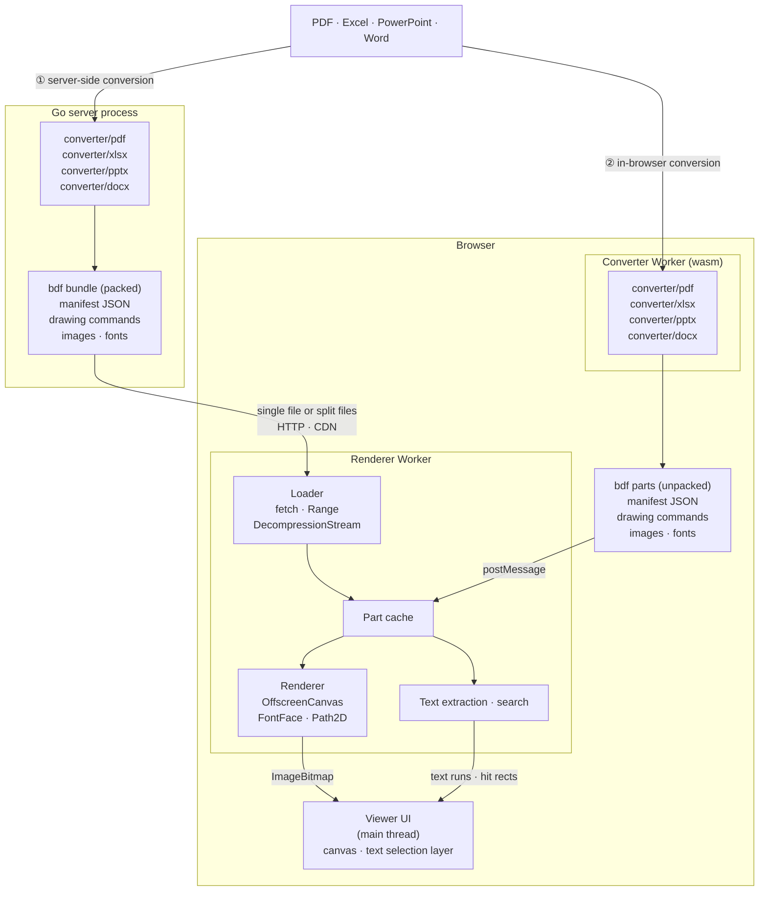

# bdf

English | [日本語](README.ja.md)

**bdf** (Browser-specific Document Format) is a draft document format for previews that browsers can draw straight onto Canvas 2D.

Office-style files (PDF, Excel, PowerPoint, Word) are converted into bdf, then drawn by a renderer that runs in a Web Worker. Whatever the browser's standard APIs already handle (font rasterization, image decoding, decompression) is left to the browser, so the decoder stays minimal.

## How it works



There are two paths. Both produce the same bdf parts and share the same renderer.

1. **Server-side conversion**: packages such as `converter/pdf` and `converter/pptx` run inside a Go server process and convert the source into a **bdf bundle** that packs the manifest, the drawing commands, the images and the fonts. The bundle is served either as a single file (streamed from the start, or fetched part by part with Range requests) or as split files that can sit on object storage or a CDN as they are. In the browser, the renderer in a Worker loads the parts it needs and draws them onto an `OffscreenCanvas`; the main thread only places the resulting bitmaps and a transparent text layer.
2. **In-browser conversion**: the same converter packages, built as wasm, run in a Worker and break the file the user opened into bdf parts (drawing commands, images, fonts). The parts go to the renderer as they are, without being packed into a bundle, so conversion and rendering both finish inside the browser and the file never leaves it.

## Features

- Three layout models: fixed-size pages (slides), an infinite plane (spreadsheets), and documents that are paginated but can also be read as one continuous scroll (word processing)
- The instruction set maps 1:1 onto `CanvasRenderingContext2D`
- Decompressed with `DecompressionStream` and drawn with `OffscreenCanvas` in a Worker
- Content-addressed parts, so masters and repeated elements are shared automatically
- A text index part and full-text search in the Worker (matches across lines, NFKC and kana normalization, hit rectangles)
- A transparent DOM text layer for selection and copy (spaces and line breaks restored from MARK boundaries; works across pages and in continuous mode)
- The single-file and split-file forms convert into each other without re-encoding (the single file starts with the magic `bdf\0`)
- The manifest can carry Dublin Core metadata (title, creator, subject, language, creation date and so on), taken over from a PDF's document information and a PowerPoint deck's core properties

Documents are converted with the `bdf generate` subcommand, which tells PDF and PowerPoint input apart by its content.

- **PDF** (`converter/pdf`): rebuilds embedded fonts (TrueType, CFF, OpenType, Type1) into WOFF2 files that hold only the glyphs in use. It checks the OS/2 embedding permission (`fsType`) and carries the copyright notices over. It also turns form XObjects into shared objects and text into searchable runs, and moves the content common to the top of every page (the master) into a shared object. See §3.1 of design.md for details.
- **PowerPoint .pptx** (`converter/pptx`): draws DrawingML directly. The shapes of slide masters and layouts become layer objects shared between slides, preset shapes come from the ECMA-376 shape formulas, and text is wrapped by the converter (Japanese line breaking rules, vertical text, bullets, paragraph formatting). Tables, charts, SmartArt and EMF/WMF pictures are drawn too. The fonts used for layout are embedded as WOFF2 subsets, so the result does not depend on the viewer's fonts. See §3.4 of design.md for details.

## Documentation

The documents are in Japanese.

- [docs/spec.md](docs/spec.md): draft format specification
- [docs/design.md](docs/design.md): the reasoning behind the design and how it is implemented

## Repository layout

| Path | Contents |
|---|---|
| `*.go`, `cmd/bdf` | Go encoder, decoder, container I/O and CLI |
| `fixture/` | Generates the sample document (with embedded fonts) |
| `imgconv/` | How images are stored (as is, or converted to WebP). Bundles a pure-Go libwebp |
| `woff2/` | TrueType/OpenType → WOFF2 (glyf transform and Brotli) |
| `converter/` | Shared converter code (input format detection, page ranges) |
| `converter/pdf` | PDF → bdf converter |
| `converter/pptx` | PowerPoint (.pptx) → bdf converter |
| `converter/internal/` | Font lookup, measurement and subsetting (`fontdb`), TrueType/OpenType reading and writing (`sfnt`) |
| `packages/core` | `@bdf/core`: TypeScript decoder, container loading, text extraction |
| `packages/render` | `@bdf/render`: Canvas renderer, page/continuous/sheet rendering, Worker |
| `examples/viewer` | Demo viewer |
| `testdata/` | Generated samples and golden images |

## Usage

```sh
# Go: tests and CLI
go test ./...
go run ./cmd/bdf demo out.bdf        # generate the sample document
go run ./cmd/bdf ls out.bdf          # list parts
go run ./cmd/bdf disasm out.bdf <hash>
go run ./cmd/bdf split out.bdf out/  # convert to the split form

# PDF / PowerPoint → bdf (the format is detected from the content; -format pdf|pptx forces it)
go run ./cmd/bdf generate in.pdf out.bdf      # single-file form
go run ./cmd/bdf generate in.pptx out/        # split form
go run ./cmd/bdf generate -pages 1-3 in.pptx out.bdf   # select pages (slides)
go run ./cmd/bdf generate -images keep in.pdf out.bdf  # do not convert images
go run ./cmd/bdf generate -dc creator=Alice -dc language=ja in.pdf out.bdf  # set Dublin Core elements (-dc name= removes one)
go run ./cmd/bdf generate -no-woff2 in.pdf out.bdf     # store fonts as TTF/OTF instead of WOFF2
go run ./cmd/bdf generate -ignore-fstype in.pdf out.bdf # embed fonts even when fsType forbids embedding or subsetting (only if you hold the rights)
go run ./cmd/bdf generate -kind flow in.pdf out.bdf    # PDF: make a flow view
go run ./cmd/bdf generate -no-share in.pdf out.bdf     # PDF: do not move the common top of each page (the master) into a shared object
go run ./cmd/bdf generate -font-dir fonts/ in.pptx out.bdf   # PowerPoint: add a directory to search for fonts
go run ./cmd/bdf generate -fonts system in.pptx out.bdf      # PowerPoint: refer to fonts by name instead of embedding them
go run ./cmd/bdf generate -hidden in.pptx out.bdf            # PowerPoint: include hidden slides
go build -tags bdf_noconv ./...                    # build without codecs (WebP, Brotli for WOFF2), for the browser
GOEXPERIMENT=simd go build ./...                   # Go 1.27 amd64/arm64: SIMD codecs (AVX2 required on amd64)

# TypeScript: build and test
npm ci
npm test                             # decoder tests (Node)
npm run test:golden                  # render in Chromium and compare with the golden images
npm run test:golden:update           # update the golden images
npm run testdata                     # regenerate testdata/ (requires Go)
npm run test:pptx:gen                # regenerate the PowerPoint test decks (requires python-pptx)
node test/render.mjs out.bdf pngdir/  # render any .bdf to PNG in Chromium

# Demo viewer
npm run demo                         # http://127.0.0.1:8765/examples/viewer/.out/
```

Go 1.27 or later is required. The golden tests use `playwright-core` at a pinned version; the golden images were drawn with the headless shell of that Chromium build. Install it with `npx playwright-core install chromium`, or point `CHROMIUM_PATH` at a headless shell of the same build.
