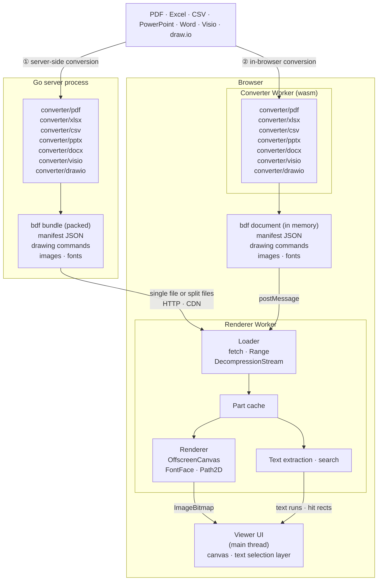

# bdf

English | [日本語](README.ja.md)

**bdf** (Browser-specific Document Format) is a draft document format for previews that browsers can draw straight onto Canvas 2D.

Office-style files (PDF, Excel, PowerPoint, Word, Visio) and draw.io diagrams are converted into bdf, then drawn by a renderer that runs in a Web Worker. Whatever the browser's standard APIs already handle (font rasterization, image decoding, decompression) is left to the browser, so the decoder stays minimal.

**Demo**: <https://shibukawa.github.io/bdf/>. Drop a PDF, Word, PowerPoint, Excel, CSV or Visio file, a draw.io diagram or a Windows metafile on the page: it is converted into bdf and drawn inside the browser, without being uploaded.

## How it works



There are two paths. Both produce the same bdf parts and share the same renderer.

1. **Server-side conversion**: packages such as `converter/pdf`, `converter/pptx` and `converter/xlsx` run inside a Go server process and convert the source into a **bdf bundle** that packs the manifest, the drawing commands, the images and the fonts. The bundle is served either as a single file (streamed from the start, or fetched part by part with Range requests) or as split files that can sit on object storage or a CDN as they are. In the browser, the renderer in a Worker loads the parts it needs and draws them onto an `OffscreenCanvas`; the main thread only places the resulting bitmaps and a transparent text layer.
2. **In-browser conversion**: the same converter packages, built as wasm (`cmd/bdfwasm`), run in a Worker and convert the file the user opened into a bdf document in memory, which goes to the renderer as it is. Conversion and rendering both finish inside the browser and the file never leaves it. The demo site works this way; the Office converters lay text out with free fonts published with the site, fetched when a document uses them.

## Features

- Three layout models: fixed-size pages (slides), an infinite plane (spreadsheets), and documents that are paginated but can also be read as one continuous scroll (word processing), optionally with a second view laid out without pages as one long column
- Several views per document (the sheets of a workbook, the pages of a draw.io diagram), which the viewer switches between with tabs like sheet tabs; links can point to another view (`#view=ID`)
- The instruction set maps 1:1 onto `CanvasRenderingContext2D`
- Decompressed with `DecompressionStream` and drawn with `OffscreenCanvas` in a Worker
- Content-addressed parts, so masters and repeated elements are shared automatically
- A text index part and full-text search in the Worker (matches across lines, NFKC and kana normalization, hit rectangles)
- A transparent DOM text layer for selection and copy (spaces and line breaks restored from MARK boundaries; works across pages and in continuous mode)
- Accessible text layers: headings, lists, tables, figures with alternative text, links and languages from structure MARKs, exposed to screen readers (tagged PDF, PowerPoint and Word structure and Excel and CSV cells, with table headers, are converted)
- The single-file and split-file forms convert into each other without re-encoding (the single file starts with the magic `bdf\0`)
- The manifest can carry Dublin Core metadata (title, creator, subject, language, creation date and so on), taken over from a PDF's document information, the core properties of PowerPoint, Excel and Word files and a Visio drawing's document properties
- Password-protected inputs (Office documents with an open password, PDFs with a user password) are converted with their password, and the bdf is encrypted with the same password. Each part is sealed on its own (AES-256-GCM), so Range requests and the split form still work; the viewer decrypts with WebCrypto, and the server does not keep the password (spec §3.5)

Documents are converted with the `bdf generate` subcommand, which tells the input formats apart by their content.

- **PDF** (`converter/pdf`): rebuilds embedded fonts (TrueType, CFF, OpenType, Type1) into WOFF2 files that hold only the glyphs in use. It checks the OS/2 embedding permission (`fsType`) and carries the copyright notices over. It also turns form XObjects into shared objects and text into searchable runs, and moves the content common to the top of every page (the master) into a shared object. Soft masks (fades, drop shadows, the masks of Chrome's CSS `mask-image`) are drawn by the viewer, JPEG 2000 and JBIG2 images are decoded by pure-Go decoders, text in CJK fonts that are not embedded is read through Adobe's predefined CMaps (Shift_JIS, EUC, UCS-2 and the others), and vertical writing (WMode 1) is laid out as vertical lines. See §3.1 of design.md for details.
- **PowerPoint .pptx** (`converter/pptx`): draws DrawingML directly. The shapes of slide masters and layouts become layer objects shared between slides, preset shapes come from the ECMA-376 shape formulas, and text is wrapped by the converter (Japanese line breaking rules, vertical text, bullets, paragraph formatting). Tables, charts, SmartArt and EMF/WMF pictures are drawn too. The fonts used for layout are embedded as WOFF2 subsets, so the result does not depend on the viewer's fonts. See §3.4 of design.md for details.
- **Excel .xlsx** (`converter/xlsx`): each worksheet becomes a sheet view whose cells are laid out by the converter and drawn into tiles: number formats (dates, Japanese eras, fractions, accounting), fonts and rich text, fills, borders, alignment (wrapping with Japanese line breaking rules, overflow into empty cells, rotation, shrink to fit), merged cells, conditional formats (color scales, data bars, icon sets, rules with formulas), tables with their styles, and pictures, shapes and charts drawn once and used by the tiles they cover. Chart sheets become pages. Column widths and row heights follow Excel's rules; frozen panes and gridlines go to the manifest. See §3.6 of design.md for details.
- **CSV / TSV** (`converter/csv`): one sheet view that looks like the file opened in Excel, drawn by the Excel converter. The character encoding (a byte order mark, UTF-8, UTF-16, Shift_JIS, EUC-JP, ISO-2022-JP, Windows-1252), the delimiter (comma, tab, semicolon, vertical bar), the quoting (double, single or none, doubled or backslash-escaped quotes) and whether the first row is a header row are guessed, and `-param` overrides each guess. Numbers and dates are aligned right as they are written (unlike Excel, `007` stays `007`), the columns are as wide as their values, values with line breaks wrap, and a header row is bold, frozen and marked as column headers; `-param table=TableStyleMedium2` formats the values as an Excel table. See §3.10 of design.md for details.
- **Visio .vsdx / .vdx** (`converter/visio`): Visio 2013 packages (.vsdx, .vsdm, .vstx) and the XML drawings of Visio 2003 to 2010 (.vdx), read into one ShapeSheet model. Shapes inherit from masters and styles, and the cells a dynamic theme sets are resolved from the theme and the shapes' quick styles. Every geometry row, fill pattern, gradient, line pattern and the 45 arrowheads are drawn; background pages become background layers shared between pages. Text is laid out by the DrawingML text engine the PowerPoint converter uses, with its fonts embedded as WOFF2 subsets. The binary .vsd format is not read. See §3.8 of design.md for details.
- **draw.io** (`converter/drawio`): draws diagrams from their mxGraphModel XML: `.drawio` files (compressed pages too) and `.drawio.svg` / `.drawio.png` exports with the diagram embedded. Every page becomes a view of its own, so the viewer switches between pages with tabs the way a spreadsheet switches sheets; draw.io layers become the view's layer objects and links to pages become `#view=` links. Cell geometry, edge routing (orthogonal, elbow and the other edge styles, perimeters), shapes, arrows, stencils and the wrapping and formatting of HTML labels are ported from draw.io's (mxGraph's) own rendering code, and fonts are embedded as subsets as for PowerPoint. AWS diagrams are drawn with the current AWS icons, also those made with older AWS icon sets, whose shapes are mapped to their current counterparts. Hand-drawn styles (`sketch=1`) are drawn normally. See §3.11 of design.md for details.
- **Word .docx** (`converter/docx`): lays the document out in the converter, which is what Word does each time it opens a file: lines (Japanese line breaking rules and spacing, tab stops and leaders, justification, the document grid), lists, tables (table styles, merged cells, rows split across pages, repeated header rows), floating pictures and text boxes with text wrapping around them, columns, sections, headers and footers with page numbers, footnotes, and East Asian vertical text (upright characters, vertical punctuation, turned Latin text and tables). Two views come out of it: the pages (a flow view with header, body and footer layers), and a scroll view laid out once more without pages as one long column of the text width, like Word's draft and web layouts. Drawings go through the same DrawingML renderer as PowerPoint, and the fonts are embedded the same way. See §3.9 of design.md for details.
- **Windows metafiles .emf / .wmf** (`converter/emf`): one page the size of the picture, drawn by replaying the metafile's records (the replay that also draws the metafile pictures inside Office documents). Text is laid out and its fonts embedded as for PowerPoint.

The input formats are static plugins: each converter package registers its format with the `converter` package when it is imported, and a program supports the formats whose packages it links in.

```go
import (
	"github.com/shibukawa/bdf/converter"
	_ "github.com/shibukawa/bdf/converter/pdf" // or converter/all for every format
)

res, err := converter.ConvertFile("in.pdf", "", &converter.Options{}) // "" detects the format
```

A password-protected input opens with `Options.Password`. When `res.Protected` reports that it needed the password, encrypt the document with the same one:

```go
res, err := converter.ConvertFile("in.pptx", "", &converter.Options{Password: password})
if err != nil {
	return err // converter.ErrPasswordRequired / ErrWrongPassword: ask for the password (CheckPassword checks one without converting)
}
if res.Protected {
	if res.Doc.Lock, err = bdf.NewPasswordLock(password, 0); err != nil { // 0: the default PBKDF2 iteration count
		return err
	}
}
```

## Documentation

The documents are in Japanese.

- [docs/spec.md](docs/spec.md): draft format specification
- [docs/design.md](docs/design.md): the reasoning behind the design and how it is implemented

## Repository layout

| Path | Contents |
|---|---|
| `*.go`, `cmd/bdf` | Go encoder, decoder, container I/O and CLI |
| `fixture/` | Generates the sample document (with embedded fonts) |
| `imgconv/` | How images are stored (as is, or converted to WebP). Bundles a pure-Go libwebp |
| `woff2/` | TrueType/OpenType → WOFF2 (glyf transform and Brotli) |
| `converter/` | Registry of the input formats, shared options, format detection, page ranges |
| `converter/pdf` | PDF → bdf converter |
| `converter/pptx` | PowerPoint (.pptx) → bdf converter |
| `converter/xlsx` | Excel (.xlsx) → bdf converter |
| `converter/csv` | CSV and TSV → bdf converter (drawn by `converter/xlsx`) |
| `converter/docx` | Word (.docx) → bdf converter |
| `converter/visio` | Visio (.vsdx, .vdx) → bdf converter |
| `converter/emf` | Windows metafile (.emf, .wmf) → bdf converter |
| `converter/drawio` | draw.io (.drawio / .drawio.svg / .drawio.png) → bdf converter |
| `converter/all` | Registers every input format (import for its side effect) |
| `converter/internal/` | Font lookup, measurement and subsetting (`fontdb`), TrueType/OpenType reading and writing (`sfnt`); shared by the Office converters: OOXML packages and XML (`ooxml`), DrawingML shapes, text, tables and charts (`ooxml/drawingml`), font choice, measuring and embedding for text layout (`fontset`), objects under construction (`canvas`), EMF/WMF replay (`metafile`), line breaking rules (`linebreak`), compound files (`cfb`) and the decryption of password-protected Office documents (`offcrypto`); for PDF, Adobe's predefined CJK CMaps (`cjkcmap`) and the JPEG 2000 and JBIG2 decoders (`jpx`, `jbig2`) |
| `packages/core` | `@bdf/core`: TypeScript decoder, container loading, text extraction |
| `packages/render` | `@bdf/render`: Canvas renderer, page/continuous/sheet rendering (scroll views render as continuous), Worker |
| `cmd/bdfwasm` | The converters built as wasm for in-browser conversion (a module for PDF, one for the Office formats) |
| `examples/viewer` | Demo viewer, and the demo site (`site.mjs`: the viewer, the converters as wasm, fonts and samples), published on GitHub Pages |
| `testdata/` | Generated samples and golden images |

## Usage

```sh
# Go: tests and CLI
go test ./...
go run ./cmd/bdf demo out.bdf        # generate the sample document
go run ./cmd/bdf ls out.bdf          # list parts
go run ./cmd/bdf disasm out.bdf <hash>
go run ./cmd/bdf split out.bdf out/  # convert to the split form

# PDF / PowerPoint / Excel / CSV / Word / Visio / draw.io / metafiles → bdf (the format is detected from the content, else from the extension; -format pdf|pptx|xlsx|csv|docx|visio|drawio|emf forces it)
go run ./cmd/bdf generate -h                  # flags and the input formats with their -param options
go run ./cmd/bdf generate in.pdf out.bdf      # single-file form
go run ./cmd/bdf generate in.pptx out/        # split form
go run ./cmd/bdf generate -pages 1-3 in.pptx out.bdf   # select pages (slides, sheets)
go run ./cmd/bdf generate -images keep in.pdf out.bdf  # do not convert images
go run ./cmd/bdf generate -dc creator=Alice -dc language=ja in.pdf out.bdf  # set Dublin Core elements (-dc name= removes one)
go run ./cmd/bdf generate -no-woff2 in.pdf out.bdf     # store fonts as TTF/OTF instead of WOFF2
go run ./cmd/bdf generate -ignore-fstype in.pdf out.bdf # embed fonts even when fsType forbids embedding or subsetting (only if you hold the rights)
go run ./cmd/bdf generate -kind flow in.pdf out.bdf    # PDF: make a flow view
go run ./cmd/bdf generate -no-share in.pdf out.bdf     # PDF: do not move the common top of each page (the master) into a shared object
go run ./cmd/bdf generate -font-dir fonts/ in.pptx out.bdf   # PowerPoint, Excel, Word: add a directory to search for fonts
go run ./cmd/bdf generate -fonts system in.pptx out.bdf      # PowerPoint, Excel, Word: refer to fonts by name instead of embedding them
go run ./cmd/bdf generate -hidden in.pptx out.bdf            # PowerPoint, Excel: include hidden slides or sheets (-param hidden=true)
go run ./cmd/bdf generate in.xlsx out.bdf                    # Excel workbook: a sheet view per worksheet
go run ./cmd/bdf generate in.csv out.bdf                     # CSV or TSV: one sheet view (encoding, delimiter, quotes and header row detected)
go run ./cmd/bdf generate -param charset=shift_jis -param delimiter=tab -param header=false in.txt out.bdf  # CSV: override the guesses
go run ./cmd/bdf generate in.docx out.bdf                    # Word: the pages and the scroll view
go run ./cmd/bdf generate -param views=pages in.docx out.bdf # Word: only the pages (views=scroll: only the scroll view)
go run ./cmd/bdf generate in.vsdx out.bdf                    # Visio (.vsdx or .vdx): a page for each foreground page
go run ./cmd/bdf generate in.emf out.bdf                     # Windows metafile (.emf or .wmf) as one page
go run ./cmd/bdf generate diagram.drawio out.bdf             # draw.io: a view per page (switched like sheets)
go run ./cmd/bdf generate -pages 2 diagram.drawio.svg out.bdf  # draw.io: page 2 only (SVG and PNG exports with the diagram embedded work too)
go run ./cmd/bdf generate -param border=0 diagram.drawio out.bdf  # draw.io: no margin around the drawing (px, default 10)
go run ./cmd/bdf generate -password-file pw.txt in.pptx out.bdf  # password-protected input (- reads stdin; default $BDF_PASSWORD); out.bdf is encrypted with the same password
go run ./cmd/bdf generate -encrypt never in.pdf out.bdf      # -encrypt auto (default: when the input needs the password), always or never
BDF_PASSWORD=… go run ./cmd/bdf ls out.bdf                   # ls, manifest, disasm and extract read encrypted documents with $BDF_PASSWORD
BDF_PASSWORD=… go run ./cmd/bdf encrypt in.bdf out.bdf       # encrypt an existing bdf (decrypt removes the encryption); split and join need no password
go build -tags bdf_noconv ./...                    # build without codecs (WebP, Brotli for WOFF2), for the browser
GOEXPERIMENT=simd go build ./...                   # Go 1.27 amd64/arm64: SIMD codecs (AVX2 required on amd64)

# TypeScript: build and test
npm ci
npm test                             # decoder tests (Node)
npm run test:golden                  # render in Chromium and compare with the golden images
npm run test:golden:update           # update the golden images
npm run testdata                     # regenerate testdata/ (requires Go)
npm run test:pptx:gen                # regenerate the PowerPoint test decks (requires python-pptx and msoffcrypto-tool)
npm run test:xlsx:gen                # regenerate the Excel test workbooks (requires openpyxl)
npm run test:docx:gen                # regenerate the Word test documents
npm run test:visio:gen               # regenerate the Visio test drawings
node test/render.mjs out.bdf pngdir/  # render any .bdf to PNG in Chromium (sheets: up to 4096 px from the top left)

# Demo viewer
npm run demo                         # http://127.0.0.1:8765/examples/viewer/.out/
# open another document with ?src= (a path under the repository), e.g. a draw.io diagram whose pages
# appear as tabs along the bottom: http://127.0.0.1:8765/examples/viewer/.out/?src=/testdata/drawio/multipage.bdf
npm run site:serve                   # demo site with in-browser conversion (requires Go): http://127.0.0.1:8766/
npm run test:site                    # convert the site's samples with its wasm modules (after npm run site)
BDF_SITE_FONTS=dir1:dir2 npm run site  # publish these fonts with the site (default: the test fonts)
```

Go 1.27 or later is required. The golden tests use `playwright-core` at a pinned version; the golden images were drawn with the headless shell of that Chromium build. Install it with `npx playwright-core install chromium`, or point `CHROMIUM_PATH` at a headless shell of the same build.
