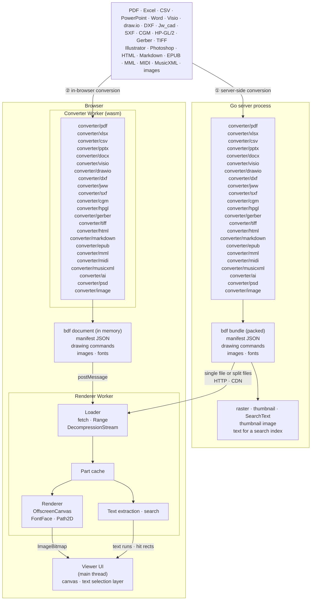

# bdf

English | [日本語](README.ja.md)

**bdf** (Browser-specific Document Format) is a draft document format for previews that browsers can draw straight onto Canvas 2D.

Office-style files (PDF, Excel, PowerPoint, Word, Visio), draw.io diagrams, CAD drawings and plot files (DXF, Jw_cad, SXF, CGM, HP-GL/2), the fabrication data of circuit boards (Gerber and Excellon), scanned or faxed TIFF images, design files (Illustrator, Photoshop), HTML pages, Markdown documents, EPUB books, music (MML, MIDI and MusicXML, engraved as scores that the viewer plays) and the images browsers display by themselves are converted into bdf, then drawn by a renderer that runs in a Web Worker. Whatever the browser's standard APIs already handle (font rasterization, image decoding, decompression) is left to the browser, so the decoder stays minimal.

**Demo**: <https://shibukawa.github.io/bdf/>. Drop a PDF, Word, PowerPoint, Excel, CSV or Visio file, a draw.io diagram, a DXF, Jw_cad, SXF or CGM drawing, an HP-GL/2 plot file, the Gerber and Excellon files of a circuit board (one file, or all of them in a zip), an Illustrator or Photoshop file, a Windows metafile, an HTML page, a Markdown document, an EPUB book, a music file (MML, MIDI or MusicXML) or an image on the page: it is converted into bdf and drawn inside the browser, without being uploaded. A PDF shows its pages as they are converted, the ones in view first, and a score plays with a cursor that follows the music. The documentation is there too: <https://shibukawa.github.io/bdf/docs/>.

## Why bdf

- **No office suite to run.** The usual way to preview Office files in a browser is to convert them into PDF with LibreOffice or OpenOffice running headless on a server: an installation of a gigabyte or more, and a process to start, keep alive and isolate. bdf's converters are Go packages without cgo or external programs. One binary converts PDF, Word, PowerPoint, Excel, CSV, Visio, draw.io, DXF, Jw_cad, SXF, CGM, HP-GL/2, Gerber, Excellon, TIFF, Illustrator, Photoshop, metafiles, HTML, Markdown, EPUB, MML, MIDI and MusicXML, and the same code built as WebAssembly converts files inside the browser (about 7 MB gzip for PDF, 5.5 MB for the Office formats, draw.io and DXF), so the files need not be uploaded at all. Thumbnails and the text for a search index come out of the same process: a pure-Go rasterizer draws the pages without a browser.
- **Shown the way the content is laid out.** A PDF cuts everything into sheets of paper. A spreadsheet printed into pages splits a wide table across them, so a row is hard to follow and a cell hard to find; the frozen headers and the gridlines go, and the sheets you switch between in a workbook become one run of pages. A Word document can only be read page by page. bdf has a layout model for each kind of content: fixed pages for slides, drawings and PDFs; a sheet view for each worksheet, an unbounded plane drawn in tiles with frozen panes, row and column headers and gridlines; and flow views for word processing, read as pages or as one continuous scroll, with a second view laid out without pages as one long column. The artboards of Illustrator and Photoshop files are pages; the sheets of a workbook, the pages of a draw.io diagram, the model space and layouts of a DXF drawing, and the top, the bottom and the layers of a circuit board are views, switched with tabs in the viewer.
- **Made for the browser.** The instruction set is Canvas 2D, one to one. Fonts are WOFF2 handed to `FontFace`, images are formats the browser decodes, and parts are compressed so that `DecompressionStream` inflates them. The browser does the font rasterizing, image decoding and inflating that a PDF viewer such as pdf.js implements in tens of thousands of lines; the bdf decoder and renderer are about 3,400 lines of TypeScript (the renderer's Worker is 21 KB gzip) and draw on an `OffscreenCanvas` in a Worker, while the main thread only places bitmaps. Parts are content-addressed, so masters and repeated objects are stored once, and a viewer fetches only the parts of the pages in view, by Range requests or from the split form on a CDN. A PDF converted in the browser is shown page by page as it is converted, the pages in view first.
- **Many formats, one renderer.** PDF, Word (.docx), PowerPoint (.pptx), Excel (.xlsx), CSV and TSV, Visio (.vsdx and .vdx), draw.io (.drawio and the SVG and PNG exports that embed the diagram), AutoCAD DXF, Jw_cad (.jww), SXF (.p21, .p2z, .sfc), CGM (.cgm), HP-GL/2 plot files (.plt), Gerber (RS-274X) and Excellon drill files (one by one, or a board's files in a zip), TIFF, Illustrator (.ai), Photoshop (.psd, .psb), Windows metafiles (.emf, .wmf), HTML (in reader mode), Markdown, EPUB (reflowable books, in Japanese vertical text too, and fixed-layout comics) MML (.mml), MIDI (.mid, .kar) and MusicXML (.musicxml, .mxl) engraved as scores, and images (PNG, JPEG, GIF, WebP, AVIF, BMP, ICO, SVG, stored as they are), password-protected Office documents and PDFs included, all become the same format. One renderer draws them, with the same search, text selection and accessible text layers (headings, lists, tables, alternative text) for every format.

## How it works


```mermaid
flowchart TB
    SRC["PDF · Excel · CSV · PowerPoint · Word · Visio · draw.io · DXF · Jw_cad · SXF · CGM · HP-GL/2 · Gerber · TIFF<br/>Illustrator · Photoshop · HTML · Markdown · EPUB · MML · MIDI · MusicXML · images"]

    subgraph SERVER["Go server process"]
        direction TB
        SCONV["converter/pdf<br/>converter/xlsx<br/>converter/csv<br/>converter/pptx<br/>converter/docx<br/>converter/visio<br/>converter/drawio<br/>converter/dxf<br/>converter/jww<br/>converter/sxf<br/>converter/cgm<br/>converter/hpgl<br/>converter/gerber<br/>converter/tiff<br/>converter/html<br/>converter/markdown<br/>converter/epub<br/>converter/mml<br/>converter/midi<br/>converter/musicxml<br/>converter/ai<br/>converter/psd<br/>converter/image"]
        BUNDLE["bdf bundle (packed)<br/>manifest JSON<br/>drawing commands<br/>images · fonts"]
        PREVIEW["raster · thumbnail · SearchText<br/>thumbnail image<br/>text for a search index"]
        SCONV --> BUNDLE
        BUNDLE --> PREVIEW
    end

    subgraph BROWSER["Browser"]
        direction TB
        subgraph CWORKER["Converter Worker (wasm)"]
            WCONV["converter/pdf<br/>converter/xlsx<br/>converter/csv<br/>converter/pptx<br/>converter/docx<br/>converter/visio<br/>converter/drawio<br/>converter/dxf<br/>converter/jww<br/>converter/sxf<br/>converter/cgm<br/>converter/hpgl<br/>converter/gerber<br/>converter/tiff<br/>converter/html<br/>converter/markdown<br/>converter/epub<br/>converter/mml<br/>converter/midi<br/>converter/musicxml<br/>converter/ai<br/>converter/psd<br/>converter/image"]
        end
        PARTS["bdf document (in memory)<br/>manifest JSON<br/>drawing commands<br/>images · fonts"]
        subgraph RWORKER["Renderer Worker"]
            LOADER["Loader<br/>fetch · Range<br/>DecompressionStream"]
            STORE["Part cache"]
            RENDER["Renderer<br/>OffscreenCanvas<br/>FontFace · Path2D"]
            TEXT["Text extraction · search"]
            LOADER --> STORE
            STORE --> RENDER
            STORE --> TEXT
        end
        UI["Viewer UI<br/>(main thread)<br/>canvas · text selection layer"]
        WCONV --> PARTS
    end

    SRC -- "① server-side conversion" --> SCONV
    SRC -- "② in-browser conversion" --> WCONV
    BUNDLE -- "single file or split files<br/>HTTP · CDN" --> LOADER
    PARTS -- "postMessage" --> LOADER
    RENDER -- "ImageBitmap" --> UI
    TEXT -- "text runs · hit rects" --> UI
```

There are two paths. Both produce the same bdf parts and share the same renderer.

1. **Server-side conversion**: packages such as `converter/pdf`, `converter/pptx` and `converter/xlsx` run inside a Go server process and convert the source into a **bdf bundle** that packs the manifest, the drawing commands, the images and the fonts. The bundle is served either as a single file (streamed from the start, or fetched part by part with Range requests) or as split files that can sit on object storage or a CDN as they are. In the browser, the renderer in a Worker loads the parts it needs and draws them onto an `OffscreenCanvas`; the main thread only places the resulting bitmaps and a transparent text layer.
2. **In-browser conversion**: the same converter packages, built as wasm (`cmd/bdfwasm`), run in a Worker and convert the file the user opened into a bdf document in memory, which goes to the renderer as it is. Conversion and rendering both finish inside the browser and the file never leaves it. The demo site works this way; the Office converters lay text out with free fonts published with the site, fetched when a document uses them. A PDF is converted a page at a time (`converter.OpenStream`): the viewer gets the page sizes first and each page as it is converted, the ones in view first, and the finished document takes their place at the end.

Next to the bundle, the server can make what a list of documents and a search engine need, while it holds the document (and, for a password-protected input, the password): a thumbnail image drawn by the Go rasterizer (`raster`, `thumbnail`), and the text of each page with the document's metadata as JSON (`Document.SearchText`).

## Features

- Three layout models: fixed-size pages (slides), an infinite plane (spreadsheets), and documents that are paginated but can also be read as one continuous scroll (word processing), optionally with a second view laid out without pages as one long column
- Several views per document (the sheets of a workbook, the pages of a draw.io diagram), which the viewer switches between with tabs like sheet tabs; links can point to another view (`#view=ID`)
- The demo viewer scrolls through pages, or fits them to the window one or two at a time, as facing pages read left to right or right to left. A page turns with the keys, the page buttons or a tap on the page (forward beyond the spine, back before it), or when a corner or the outer edge of the page is pulled. The page curls in WebGL, textured with the pages before and after it, which are rendered ahead of time; with the animate box unchecked (at first when the system asks for reduced motion), pages change at once. The rest of the page keeps its text selection. Books bound on the right (views with `direction: "rtl"`, as in Japanese vertical EPUB books and right-to-left comics) are laid out and turned right to left, and EPUB books open as facing pages (`?layout=pages`, `single`, `spread` or `spread-rtl` opens documents in a given layout)
- The instruction set maps 1:1 onto `CanvasRenderingContext2D`
- Decompressed with `DecompressionStream` and drawn with `OffscreenCanvas` in a Worker
- Content-addressed parts, so masters and repeated elements are shared automatically
- A text index part and full-text search in the Worker (matches across lines, NFKC and kana normalization, hit rectangles)
- A transparent DOM text layer for selection and copy (spaces and line breaks restored from MARK boundaries; works across pages and in continuous mode)
- Accessible text layers: headings, lists, tables, figures with alternative text, links and languages from structure MARKs, exposed to screen readers (tagged PDF, PowerPoint and Word structure, Excel and CSV cells, with table headers, and HTML, Markdown and EPUB elements are converted)
- The single-file and split-file forms convert into each other without re-encoding (the single file starts with the magic `bdf\0`)
- Formulas: Office Math in Word documents and in PowerPoint and Excel text (rather than the pictures those keep as fallbacks), MathML in HTML pages and EPUB books (and the MathML beside KaTeX's, MathJax's and Wikipedia's own renderings) and LaTeX in Markdown and in draw.io labels (`math=1`) are laid out by one formula engine, with the parameters and glyph variants of an OpenType MATH font (STIX Two Math, Cambria Math, Latin Modern Math …): fractions, radicals, scripts and limits, large operators, delimiters and radicals that grow from larger variants and assemblies of parts, matrices, aligned equations and accents. Search and copy see a formula in a linear notation such as `x=(−b±√(b^2−4ac))/(2a)` (typed with a hyphen-minus, it is found). See §3.23 of design.md for details
- Music: MML, MIDI and MusicXML are engraved in staff notation by the converter, and the view carries the music as a Standard MIDI File with cues that tie its time to places on the pages (spec §4.4). The demo viewer plays it with the Web Audio API (oscillators by General MIDI program family, synthesized drums, the square waves of chip-tune MML), shows a cursor on the system being played, turns or scrolls the pages with it, and seeks where a system is clicked. See §3.26 of design.md
- The manifest can carry Dublin Core metadata (title, creator, subject, language, creation date and so on), taken over from a PDF's document information, the core properties of PowerPoint, Excel and Word files, a Visio drawing's document properties, the XMP metadata of a Photoshop document, an HTML page's meta elements, a Markdown document's front matter, an EPUB book's package document and an image's XMP, EXIF and IPTC metadata
- Password-protected inputs (Office documents with an open password, PDFs with a user password) are converted with their password, and the bdf is encrypted with the same password. Each part is sealed on its own (AES-256-GCM), so Range requests and the split form still work; the viewer decrypts with WebCrypto, and the server does not keep the password (spec §3.5)
- Thumbnails and search text on the server: `raster` draws any page (or a region of a sheet or a scroll view) into an image in pure Go, with the same instructions the viewer runs: anti-aliased paths, strokes, clips, gradients and patterns, images, text in the embedded fonts (WOFF2 decoded) and in the system's fonts for fonts referred to by name, groups, soft masks, shadows, and SVG images. A Go test draws the pages of the browser's golden test and compares them with Chromium's once both are scaled down: most differ by less than 4/255 on average (text is not hinted, kerned or joined into ligatures, and AVIF images are not drawn). `thumbnail` picks the layout from the kind of document: the top-left square of the first page for Word, HTML, Markdown, scores and portrait PDFs, the top-left corner from A1 for Excel and CSV, the whole first page for slides, drawings, images and EPUB covers; PNG, JPEG or WebP. `Document.SearchText` gives the metadata and the text of each page (a sheet whole) for a search engine. Neither is written for an encrypted document unless asked for (`-allow-plaintext`), since they are not encrypted. See §3.25 of design.md

Documents are converted with the `bdf generate` subcommand, which tells the input formats apart by their content, else by their extension (the extension decides for Markdown, which could be any text).

- **PDF** (`converter/pdf`): rebuilds embedded fonts (TrueType, CFF, OpenType, Type1) into WOFF2 files that hold only the glyphs in use. It checks the OS/2 embedding permission (`fsType`) and carries the copyright notices over. It also turns form XObjects into shared objects and text into searchable runs, and moves the content common to the top of every page (the master) into a shared object. Soft masks (fades, drop shadows, the masks of Chrome's CSS `mask-image`) are drawn by the viewer, JPEG 2000 and JBIG2 images are decoded by pure-Go decoders, text in CJK fonts that are not embedded is read through Adobe's predefined CMaps (Shift_JIS, EUC, UCS-2 and the others), vertical writing (WMode 1) is laid out as vertical lines, and optional content (layers) is shown as a viewer shows it when it opens the document: hidden layers are left out. See §3.1 of design.md for details.
- **Illustrator .ai** (`converter/ai`): an .ai file of Illustrator 9 or later is a PDF with Illustrator's own data beside it. Its PDF pages are the artboards, drawn by the PDF converter and cut to the artboard (the trim box, without the bleed); hidden layers stay hidden. Files saved without "Create PDF Compatible File" and the PostScript-based .ai of Illustrator 8 and earlier are reported as errors. See §3.17 of design.md for details.
- **Photoshop .psd / .psb** (`converter/psd`): the image Photoshop composited, one page per visible artboard (or the whole canvas), sized by the document's resolution. Every colour mode and depth is read (RGB, CMYK, grayscale, Lab, indexed, bitmap; 8, 16 and 32 bits), and the large document format too. A file saved without "Maximize Compatibility" has no composite: the converter composites the layers itself (blend modes, masks, clipping masks, groups, fill layers; not adjustment layers or layer effects). Pages finer than the resolution cap of image inputs are scaled down to it, as TIFF pages are. See §3.18 of design.md for details.
- **PowerPoint .pptx** (`converter/pptx`): draws DrawingML directly. The shapes of slide masters and layouts become layer objects shared between slides, preset shapes come from the ECMA-376 shape formulas, and text is wrapped by the converter (Japanese line breaking rules, vertical text, bullets, paragraph formatting). Tables, charts, SmartArt, EMF/WMF pictures and equations are drawn too. The fonts used for layout are embedded as WOFF2 subsets, so the result does not depend on the viewer's fonts. See §3.4 of design.md for details.
- **Excel .xlsx** (`converter/xlsx`): each worksheet becomes a sheet view whose cells are laid out by the converter and drawn into tiles: number formats (dates, Japanese eras, fractions, accounting), fonts and rich text, fills, borders, alignment (wrapping with Japanese line breaking rules, overflow into empty cells, rotation, shrink to fit), merged cells, conditional formats (color scales, data bars, icon sets, rules with formulas), tables with their styles, and pictures, shapes and charts drawn once and used by the tiles they cover. Chart sheets become pages. Column widths and row heights follow Excel's rules; frozen panes and gridlines go to the manifest. See §3.6 of design.md for details.
- **CSV / TSV** (`converter/csv`): one sheet view that looks like the file opened in Excel, drawn by the Excel converter. The character encoding (a byte order mark, UTF-8, UTF-16, Shift_JIS, EUC-JP, ISO-2022-JP, Windows-1252), the delimiter (comma, tab, semicolon, vertical bar), the quoting (double, single or none, doubled or backslash-escaped quotes) and whether the first row is a header row are guessed, and `-param` overrides each guess. Numbers and dates are aligned right as they are written (unlike Excel, `007` stays `007`), the columns are as wide as their values, values with line breaks wrap, and a header row is bold, frozen and marked as column headers; `-param table=TableStyleMedium2` formats the values as an Excel table. See §3.10 of design.md for details.
- **Visio .vsdx / .vdx** (`converter/visio`): Visio 2013 packages (.vsdx, .vsdm, .vstx) and the XML drawings of Visio 2003 to 2010 (.vdx), read into one ShapeSheet model. Shapes inherit from masters and styles, and the cells a dynamic theme sets are resolved from the theme and the shapes' quick styles. Every geometry row, fill pattern, gradient, line pattern and the 45 arrowheads are drawn; background pages become background layers shared between pages. Text is laid out by the DrawingML text engine the PowerPoint converter uses, with its fonts embedded as WOFF2 subsets. The binary .vsd format is not read. See §3.8 of design.md for details.
- **draw.io** (`converter/drawio`): draws diagrams from their mxGraphModel XML: `.drawio` files (compressed pages too) and `.drawio.svg` / `.drawio.png` exports with the diagram embedded. Every page becomes a view of its own, so the viewer switches between pages with tabs the way a spreadsheet switches sheets; draw.io layers become the view's layer objects and links to pages become `#view=` links. Cell geometry, edge routing (orthogonal, elbow and the other edge styles, perimeters), shapes, arrows, stencils and the wrapping and formatting of HTML labels are ported from draw.io's (mxGraph's) own rendering code, and fonts are embedded as subsets as for PowerPoint. AWS diagrams are drawn with the current AWS icons, also those made with older AWS icon sets, whose shapes are mapped to their current counterparts. Hand-drawn styles (`sketch=1`) are drawn normally. With math typesetting on (`math=1`), the LaTeX in labels is laid out as formulas. See §3.11 of design.md for details.
- **Word .docx** (`converter/docx`): lays the document out in the converter, which is what Word does each time it opens a file: lines (Japanese line breaking rules and spacing, tab stops and leaders, justification, the document grid), lists, tables (table styles, merged cells, rows split across pages, repeated header rows), floating pictures and text boxes with text wrapping around them, columns, sections, headers and footers with page numbers, footnotes, East Asian vertical text (upright characters, vertical punctuation, turned Latin text and tables), and formulas (Office Math). Two views come out of it: the pages (a flow view with header, body and footer layers), and a scroll view laid out once more without pages as one long column of the text width, like Word's draft and web layouts. Drawings go through the same DrawingML renderer as PowerPoint, and the fonts are embedded the same way. See §3.9 of design.md for details.
- **AutoCAD .dxf** (`converter/dxf`): DXF drawings in text or binary, from R12 to 2018 (DWG, whose format is not published, is not read). Model space becomes a page fitted to the drawing on the dark background of CAD programs, and each paper space layout a page of its paper, where the viewports show model space at their scale. Layers, colors, line types and lineweights are resolved as a plotter would draw them; polylines with bulges and widths, splines (as exact Bézier curves), hatches (patterns, islands, gradients), blocks and block arrays with attributes, dimensions, leaders and multileaders, single-line and multiline text (formatting codes, wrapping with Japanese line breaking rules, stacked fractions) are drawn. SHX fonts are replaced by sans-serif fonts and big fonts by East Asian ones, and the fonts in use are embedded as WOFF2 subsets. Strings in older files are read in their code page (Shift_JIS and others). See §3.12 of design.md for details.
- **Jw_cad .jww** (`converter/jww`): the drawings of Jw_cad, read by its published data format from version 2 to version 7 and later files. A drawing is one page of its sheet (grown to hold what lies outside it), drawn in the screen colors saved in the file on its background (`-param colors=print` for the printer colors on white, `colors=mono` for black on white), with the printed line widths and line types: lines, arcs and ellipses, points, text in Jw_cad's fixed pitch (full-width characters as wide as the text size, half-width ones half as wide, vertical text), dimensions, solids including circle solids, and nested blocks. Hidden layers and auxiliary lines are left out, as Jw_cad does not print them. See §3.13 of design.md for details.
- **SXF .p21 / .p2z / .sfc** (`converter/sxf`): the CAD exchange format of Japanese public works deliveries (電子納品), SXF Ver.2 to Ver.3.1, in both its encodings: the STEP AP202 files (.p21, and .p2z, a zipped P21 file) that deliveries hold, and the feature comment files (.sfc) of CAD programs. A drawing is one page of its sheet (grown to hold what lies outside it) on the background color the drawing names, black when it does not, as SXF viewers show drawings (`-param background=light` for white paper). The predefined and user-defined colors, line types and widths, lines, polylines, circles, arcs, ellipses, splines, clothoids, point markers, text at its nine anchors (turned, slanted, spaced, vertical), compound figures (placed, scaled, nested, in geodetic coordinates), dimensions, leaders and balloons, color fills, hatching and blank areas are drawn; hidden layers are left out. The files written by the SCADEC library, which most SXF writers use, are read the way it reads them back. See §3.14 of design.md for details.
- **CGM .cgm** (`converter/cgm`): Computer Graphics Metafiles (ISO/IEC 8632, versions 1 to 4), in the binary encoding that CAD plotter drivers, technical illustration tools (S1000D, ATA) and WebCGM write and in the clear text encoding, compressed with gzip (.cgz) too. Each picture becomes a page, the size of its metric scale (abstract pictures are fitted to A4). Lines with their types, widths and caps, markers, filled areas (hollow, solid, hatched, patterned, gradient) and their edges, closed figures with holes, circles, ellipses, circular, elliptical, hyperbolic and parabolic arcs, Bézier curves and B-splines, text (turned and slanted by its orientation vectors, in four paths including vertical text, aligned, restricted to boxes, appended), cell arrays and tiles (JPEG, PNG, CCITT fax), and segments and their copies are drawn; WebCGM application structures whose visibility is off are left out. Strings are read in their character sets (JIS X 0208 and the other ISO 2022 sets, UTF-8 and UTF-16), and the undeclared Shift_JIS text of Japanese CAD programs is recognized. See §3.20 of design.md for details.
- **HP-GL/2 .plt** (`converter/hpgl`): the plot files of HP plotters and printers: HP-GL/2, and the HP-GL of older pen plotters and cutters, bare or in the PJL job with PCL or HP RTL escape sequences around it that files printed to a large-format plotter (a DesignJet driver printing to a file) or to a PCL printer carry, with the raster images of HP RTL. Each plotted page becomes a page: the plot size (PS) grown to hold what is drawn outside it, seen in the coordinate system RO turned (drivers turn plots to the paper that way), or the page and picture frame of a PCL printer. Pens draw in the colors and widths of the file's palette (`-param colors=mono` for black), with fixed, adaptive and user-defined line types, line ends and joins: arcs and circles (a coarse chord angle as the chords a plotter draws), Bézier curves, encoded polylines, polygons, rectangles and wedges filled solid, hatched, cross-hatched, shaded or with raster patterns, screened vectors, user scaling and the clipping window. Labels become text: the plotter's stick font is drawn with a fixed-pitch font at its cap height and pitch, designated fonts with fonts of their kind, turned, slanted, mirrored, in the four text paths and placed by the label origin, in Roman-8 and the other symbol sets, and in Japanese (Shift_JIS, 16-bit JIS). Raster images (compression methods 0 to 3, 5 and 9, indexed or direct colors) are scaled down to the resolution cap as they arrive. See §3.22 of design.md for details.
- **Gerber and Excellon (circuit boards)** (`converter/gerber`): the fabrication data of printed circuit boards: Gerber files (RS-274X with the X2 attributes, and the deprecated commands of older files) and Excellon drill files, one by one or the files of a board in a zip archive (with its Gerber job file). A board becomes a view of its top and one of its bottom (seen from below, mirrored), drawn the way the board looks: the substrate, the copper seen through the solder mask, the finish of the pads the mask leaves bare, the silkscreen and the holes, cut to the outline (the lines of the outline layer joined into the board's shape, cut-outs included); then a view for each file, in the colors of PCB design tools on their dark background. What each file is comes from its X2 attributes, the job file, or the file naming of KiCad, Altium (Protel), Eagle, EasyEDA and others. Every aperture and macro primitive, arcs in both quadrant modes, regions, clear polarity, step and repeat, block apertures and aperture transformations are drawn; pads are drawn as runs of shared paths, as glyphs are. `-param mask=`, `silkscreen=` and `finish=` pick the colors (by default the job file's, else green, white and gold), `-param views=board` or `views=layers` one kind of view. See §3.21 of design.md for details.
- **HTML .html / .xhtml / .mhtml** (`converter/html`): laid out like a browser's reader view, keeping the content and leaving the page's design (its CSS) out: the elements take the formatting of a fixed style sheet. The article is picked out of web pages with go-readability (a port of Mozilla's Readability), and headings, paragraphs, lists, quotations, code, tables (with merged cells and column widths that follow their content), figures, links and MathML formulas are laid out by the layout engine the Word converter uses. BDF does not lay text out again, so the page becomes a scroll view of a fixed width (36 ems of text by default; A4 pages can be added). Images are read from the files beside the page, from an MHTML archive, from data: URLs and from the network (fetched by default; `-param remote=false` leaves them out). SVG images, both SVG files and svg elements in the page, are stored as they are and drawn by the viewer, sized as browsers size them. The fonts are referred to by name, not embedded, so viewers draw the text with their own fonts as they would a web page (`-fonts embed` embeds them). See §3.16 of design.md for details.
- **Markdown .md** (`converter/markdown`): rendered to HTML with goldmark (CommonMark with GitHub's tables, task lists, strikethrough and autolinks, footnotes and definition lists) and laid out as HTML is. The raw HTML READMEs often hold (`<p align="center">`, `<details>`) is laid out with the rest, and headings get GitHub's ids, so links to them work. Math is written as on GitHub: `$…$`, `$$…$$` and `math` code blocks in LaTeX. YAML or TOML front matter becomes the Dublin Core metadata.
- **EPUB .epub** (`converter/epub`): EPUB 3 and EPUB 2 books. A reflowable book is laid out in reader mode like HTML, its documents in reading order, each chapter from the top of a page, into book pages (A5 by default, `-param paper=`) with page numbers; covers and full-page pictures fill their pages. The content documents are read as XML (an empty `<a id="p5"/>` does not swallow what follows). The book's CSS is left out except for what carries meaning in books: the writing mode, so that Japanese books in vertical text (`writing-mode: vertical-rl`, as the Denshoken guide writes them) are laid out vertically, tate-chu-yoko, emphasis marks, alignment, hidden elements and the size of gaiji pictures. SVG is drawn (SVG files, svg elements and SVG pages), and MathML formulas are laid out by the formula engine, upright in vertical text. Links between chapters go to their pages. A fixed-layout book of pictures (comics, photo books) becomes a page per picture at the size of its viewport. Books bound on the right get views whose `direction` is `rtl` (spec §4.1). Encrypted books (DRM) are refused. See §3.24 of design.md for details.
- **Music: MML .mml, MIDI .mid / .kar, MusicXML .musicxml / .mxl** (`converter/mml`, `converter/midi`, `converter/musicxml`): scores engraved on A4 pages in staff notation with the SMuFL font Bravura (its glyphs drawn as shared paths), and the music stored for the viewer to play. MML (the generic dialect of FlMML and the BASIC PLAY statement, Mabinogi's `MML@…;` and the NES MCK/PPMCK track lines) and MIDI files are performances: the notes are quantized to note values (ties across beats and bar lines, dots, triplets), divided into measures and two voices a staff, spelled in the key (the file's, or one estimated from the notes), and put on clefs chosen by their range, keyboards on a grand staff; MIDI lyrics and karaoke text are set under the notes. MusicXML is read as written: parts on several staves, voices, chords, beams, tuplets, grace notes, accidentals, ties and slurs, articulations and ornaments, dynamics and hairpins, words, chord symbols, pedal and octave lines, lyrics in verses, clef, key and time changes, repeats and voltas, tempo and rehearsal marks and system breaks; its music is played with the repeats taken. A MIDI file is played as it is; MML and MusicXML become a Standard MIDI File. See §3.26 of design.md for details.
- **Windows metafiles .emf / .wmf** (`converter/emf`): one page the size of the picture, drawn by replaying the metafile's records (the replay that also draws the metafile pictures inside Office documents). Text is laid out and its fonts embedded as for PowerPoint.
- **TIFF .tif / .tiff** (`converter/tiff`): a page for each page of the file, the size its resolution gives, drawn by one image. The TIFF reader is the module's own: classic TIFF and BigTIFF, strips and tiles, no compression, PackBits, LZW, Deflate, JPEG, and CCITT fax coding (Group 3 one- and two-dimensional, with or without fill bits, and Group 4), in bilevel, grey, palette, RGB and CMYK pixels of 1 to 16 bits. The Orientation tag turns the page. Pages finer than the resolution cap (192 dpi and 3840 × 3840 pixels by default, `-max-dpi` and `-max-pixels`) are scaled down to it, bilevel pages staying bilevel; JPEG pages that need no scaling are stored as one JPEG joined from their strips without re-encoding. See §3.15 of design.md for details.
- **Images .png / .jpg / .gif / .webp / .avif / .bmp / .ico / .svg** (`converter/image`): images that browsers display by themselves pass through. They are stored as they are, neither decoded nor re-encoded, and drawn on one page their size, so they look as they do when the browser opens the file. The converter reads only their size (with the EXIF orientation of JPEG and PNG images and the `irot` of AVIF) and their metadata: XMP, EXIF and IPTC, PNG text chunks and an SVG file's title, description and RDF become Dublin Core as other formats' properties do, and the description is the figure's alternative text. Workers cannot decode SVG, so the page draws SVG images at the size they are shown, sharp at every zoom (the SVG pictures of Office documents and draw.io diagrams too). See §3.19 of design.md for details.

The input formats are static plugins: each converter package registers its format with the `converter` package when it is imported, and a program supports the formats whose packages it links in.

```go
import (
	"github.com/shibukawa/bdf/converter"
	_ "github.com/shibukawa/bdf/converter/pdf" // or converter/all for every format
)

res, err := converter.ConvertFile("in.pdf", "", &converter.Options{}) // "" detects the format
```

A password-protected input opens with `Options.Password`. When `res.Protected` reports that it needed the password, encrypt the document with the same one:

```go
res, err := converter.ConvertFile("in.pptx", "", &converter.Options{Password: password})
if err != nil {
	return err // converter.ErrPasswordRequired / ErrWrongPassword: ask for the password (CheckPassword checks one without converting)
}
if res.Protected {
	if res.Doc.Lock, err = bdf.NewPasswordLock(password, 0); err != nil { // 0: the default PBKDF2 iteration count
		return err
	}
}
```

A thumbnail and the text for a search index are made from the document, before it is written or from a bdf read back (`Reader.ToDocument`):

```go
th, err := thumbnail.Make(res.Doc, &thumbnail.Options{Size: 256}) // Mode: thumbnail.Crop or Fit instead of the layout of the kind of document
if err != nil {
	return err
}
err = thumbnail.Encode(w, th.Image, thumbnail.WebP) // or thumbnail.PNG, thumbnail.JPEG
text, err := res.Doc.SearchText() // metadata, and the text of each view page by page; encode it as JSON
```

## Documentation

The documents are in Japanese. They are also published, with this README, at <https://shibukawa.github.io/bdf/docs/>.

- [docs/api.md](docs/api.md): the APIs, package by package (Go converters and writer, the command, the wasm converters, `@bdf/core`, `@bdf/render`)
- [docs/spec.md](docs/spec.md): draft format specification
- [docs/design.md](docs/design.md): the reasoning behind the design and how it is implemented

## Repository layout

| Path | Contents |
|---|---|
| `*.go`, `cmd/bdf` | Go encoder, decoder, container I/O and CLI |
| `fixture/` | Generates the sample document (with embedded fonts) |
| `imgconv/` | How images are stored (as is, or converted to WebP). Bundles a pure-Go libwebp |
| `woff2/` | TrueType/OpenType ↔ WOFF2 (glyf transform and Brotli) |
| `raster/` | Draws pages into images in pure Go, as the viewer does: the software rasterizer, and an SVG renderer for SVG images |
| `thumbnail/` | Thumbnails of documents: the layout by the kind of document, and PNG, JPEG or WebP |
| `internal/` | Font lookup, measurement and subsetting (`fontdb`), TrueType/OpenType reading, writing and glyph outlines (`sfnt`), CFF reading and subsetting (`cff`): shared by the converters and `raster` |
| `converter/` | Registry of the input formats, shared options, format detection, page ranges |
| `converter/pdf` | PDF → bdf converter |
| `converter/ai` | Illustrator (.ai) → bdf converter, over the PDF converter |
| `converter/psd` | Photoshop (.psd, .psb) → bdf converter |
| `converter/pptx` | PowerPoint (.pptx) → bdf converter |
| `converter/xlsx` | Excel (.xlsx) → bdf converter |
| `converter/csv` | CSV and TSV → bdf converter (drawn by `converter/xlsx`) |
| `converter/docx` | Word (.docx) → bdf converter |
| `converter/visio` | Visio (.vsdx, .vdx) → bdf converter |
| `converter/dxf` | AutoCAD DXF → bdf converter |
| `converter/jww` | Jw_cad (.jww) → bdf converter |
| `converter/sxf` | SXF (.p21, .p2z, .sfc) → bdf converter |
| `converter/cgm` | CGM (.cgm, .cgz) → bdf converter |
| `converter/hpgl` | HP-GL/2 plot files (.plt; HP-GL, PJL, PCL and HP RTL) → bdf converter |
| `converter/gerber` | Gerber and Excellon (and zip archives of a board's files) → bdf converter |
| `converter/html` | HTML (.html, .xhtml, .mhtml) → bdf converter, in reader mode |
| `converter/markdown` | Markdown → bdf converter (through HTML) |
| `converter/epub` | EPUB → bdf converter (reflowable books in reader mode, fixed-layout books of pictures) |
| `converter/mml` | MML (.mml; generic, Mabinogi, PPMCK) → bdf converter, as a score |
| `converter/midi` | Standard MIDI Files (.mid, .kar, .rmi) → bdf converter, as a score |
| `converter/musicxml` | MusicXML (.musicxml, .mxl) → bdf converter |
| `converter/emf` | Windows metafile (.emf, .wmf) → bdf converter |
| `converter/drawio` | draw.io (.drawio / .drawio.svg / .drawio.png) → bdf converter |
| `converter/tiff` | TIFF (.tif, .tiff) → bdf converter |
| `converter/image` | Image (PNG, JPEG, GIF, WebP, AVIF, BMP, ICO, SVG) → bdf converter (stores the image as it is and reads its metadata) |
| `converter/all` | Registers every input format (import for its side effect) |
| `converter/internal/` | Shared by the Office converters: OOXML packages and XML (`ooxml`), DrawingML shapes, text, tables and charts (`ooxml/drawingml`), font choice, measuring and embedding for text layout (`fontset`, draw.io too), objects under construction (`canvas`, draw.io too), EMF/WMF replay (`metafile`), CAD drawings plotted onto pages (`cad`), line breaking rules (`linebreak`), compound files (`cfb`) and the decryption of password-protected Office documents (`offcrypto`); for PDF, Adobe's predefined CJK CMaps (`cjkcmap`) and the JPEG 2000 and JBIG2 decoders (`jpx`, `jbig2`); the TIFF reader with its CCITT fax decoder (`tiff`); the layout engine of Word, HTML, Markdown and EPUB documents (`wordproc`: paragraphs, tables, pages and scroll views) and the HTML and XHTML reader they share (`webdoc`); the Dublin Core of XMP metadata (`xmp`); the engraving of MML, MIDI and MusicXML scores and the music they play (`music`, with the SMuFL glyphs of Bravura in `music/smufl`) |
| `packages/core` | `@bdf/core`: TypeScript decoder, container loading, text extraction |
| `packages/render` | `@bdf/render`: Canvas renderer, page/continuous/sheet rendering (scroll views render as continuous), Worker (SVG images are drawn on the main thread) |
| `cmd/bdfwasm` | The converters built as wasm for in-browser conversion (modules for PDF, the Office formats, HTML and Markdown, and images) |
| `examples/viewer` | Demo viewer, and the demo site (`site.mjs`: the viewer, the converters as wasm, fonts, samples and the documentation as HTML), published on GitHub Pages |
| `testdata/` | Generated samples and golden images |

## Usage

```sh
# Go: tests and CLI
go test ./...
go run ./cmd/bdf demo out.bdf        # generate the sample document
go run ./cmd/bdf ls out.bdf          # list parts
go run ./cmd/bdf disasm out.bdf <hash>
go run ./cmd/bdf split out.bdf out/  # convert to the split form

# PDF / Illustrator / Photoshop / PowerPoint / Excel / CSV / Word / Visio / draw.io / DXF / Jw_cad / SXF / CGM / HP-GL/2 / Gerber / metafiles / TIFF / HTML / Markdown / EPUB / MML / MIDI / MusicXML / images → bdf (the format is detected from the content, else from the extension; -format pdf|ai|psd|pptx|xlsx|csv|docx|visio|drawio|dxf|jww|sxf|cgm|hpgl|gerber|emf|tiff|html|markdown|epub|mml|midi|musicxml|image forces it)
go run ./cmd/bdf generate -h                  # flags and the input formats with their -param options
go run ./cmd/bdf generate in.pdf out.bdf      # single-file form
go run ./cmd/bdf generate in.pptx out/        # split form
go run ./cmd/bdf generate -pages 1-3 in.pptx out.bdf   # select pages (slides, sheets)
go run ./cmd/bdf generate -pages 2,5- in.pdf out.bdf    # page 2 and page 5 to the last
go run ./cmd/bdf generate -images keep in.pdf out.bdf  # do not convert images
go run ./cmd/bdf generate -dc creator=Alice -dc language=ja in.pdf out.bdf  # set Dublin Core elements (-dc name= removes one)
go run ./cmd/bdf generate -no-woff2 in.pdf out.bdf     # store fonts as TTF/OTF instead of WOFF2
go run ./cmd/bdf generate -ignore-fstype in.pdf out.bdf # embed fonts even when fsType forbids embedding or subsetting (only if you hold the rights)
go run ./cmd/bdf generate -kind flow in.pdf out.bdf    # PDF: make a flow view
go run ./cmd/bdf generate -no-share in.pdf out.bdf     # PDF: do not move the common top of each page (the master) into a shared object
go run ./cmd/bdf generate -param box=trim in.pdf out.bdf     # PDF: pages cut to the trim box (media, bleed, trim, art; default crop)
go run ./cmd/bdf generate in.ai out.bdf                      # Illustrator: a page per artboard (-param box=bleed keeps the bleed)
go run ./cmd/bdf generate in.psd out.bdf                     # Photoshop (.psd or .psb): a page per artboard, or the canvas
go run ./cmd/bdf generate -param artboards=false in.psd out.bdf  # Photoshop: the whole canvas on one page
go run ./cmd/bdf generate -font-dir fonts/ in.pptx out.bdf   # PowerPoint, Excel, Word, HTML, Markdown, EPUB: add a directory to search for fonts
go run ./cmd/bdf generate -fonts system in.pptx out.bdf      # PowerPoint, Excel, Word: refer to fonts by name instead of embedding them (what HTML, Markdown and EPUB do by default)
go run ./cmd/bdf generate -fonts embed in.md out.bdf         # HTML, Markdown, EPUB: embed the fonts the text is laid out with
go run ./cmd/bdf generate -hidden in.pptx out.bdf            # PowerPoint, Excel: include hidden slides or sheets (-param hidden=true)
go run ./cmd/bdf generate in.xlsx out.bdf                    # Excel workbook: a sheet view per worksheet
go run ./cmd/bdf generate in.csv out.bdf                     # CSV or TSV: one sheet view (encoding, delimiter, quotes and header row detected)
go run ./cmd/bdf generate -param charset=shift_jis -param delimiter=tab -param header=false in.txt out.bdf  # CSV: override the guesses
go run ./cmd/bdf generate in.docx out.bdf                    # Word: the pages and the scroll view
go run ./cmd/bdf generate -param views=pages in.docx out.bdf # Word: only the pages (views=scroll: only the scroll view)
go run ./cmd/bdf generate in.vsdx out.bdf                    # Visio (.vsdx or .vdx): a page for each foreground page
go run ./cmd/bdf generate in.dxf out.bdf                     # DXF: model space and each layout as a view of one page
go run ./cmd/bdf generate -param views=model in.dxf out.bdf # DXF: model space only (views=layouts: the layouts only)
go run ./cmd/bdf generate -param background=light in.dxf out.bdf # DXF: model space on white paper instead of a dark background
go run ./cmd/bdf generate in.jww out.bdf                     # Jw_cad: one page of the sheet, in the screen colors of the file
go run ./cmd/bdf generate -param colors=print in.jww out.bdf # Jw_cad: in its printer colors on white paper (colors=mono: black)
go run ./cmd/bdf generate in.p21 out.bdf                     # SXF (.p21, .p2z or .sfc): one page of the sheet on its background
go run ./cmd/bdf generate -param background=light in.p21 out.bdf # SXF: on white paper
go run ./cmd/bdf generate in.cgm out.bdf                     # CGM (binary or clear text, .cgz too): a page per picture
go run ./cmd/bdf generate in.plt out.bdf                     # HP-GL/2 (and HP-GL, and jobs with PJL, PCL and HP RTL): a page for each plotted page
go run ./cmd/bdf generate -param colors=mono in.plt out.bdf  # HP-GL/2: every pen but pen 0 black, as a monochrome plotter draws
go run ./cmd/bdf generate board.zip out.bdf                  # circuit board (Gerber, Excellon and the job file in a zip): its top, its bottom and a view per file
go run ./cmd/bdf generate board-F_Cu.gbr out.bdf             # one Gerber or drill file: a view of its layer
go run ./cmd/bdf generate -param mask=black -param finish=silver board.zip out.bdf  # circuit board: the colors of the solder mask and the pads (silkscreen= too)
go run ./cmd/bdf generate page.html out.bdf                  # HTML: the article, in a scroll view of one column (-param extract=none: the whole page; article: always pick the article out)
go run ./cmd/bdf generate page.mhtml out.bdf                 # web archive (MHTML): the images come from the archive
go run ./cmd/bdf generate README.md out.bdf                  # Markdown: images from the files beside it (and from the network)
go run ./cmd/bdf generate -param remote=false -param width=480 -param views=both in.md out.bdf  # fetch no images, a text width of 480 pt, A4 pages too
go run ./cmd/bdf generate song.mid out.bdf                   # MIDI: a score, and the file played as it is
go run ./cmd/bdf generate -param time=3/4 -param key=F song.mid out.bdf  # MIDI, MML: the time and key signatures instead of the file's (or the estimated key)
go run ./cmd/bdf generate tune.mml out.bdf                   # MML: the dialect from the content (-param dialect=generic|mabinogi|ppmck, octave=reverse)
go run ./cmd/bdf generate score.mxl out.bdf                  # MusicXML (.musicxml or the compressed .mxl): the score as written, played with its repeats
go run ./cmd/bdf generate book.epub out.bdf                  # EPUB: A5 book pages (fixed-layout books: a page per picture)
go run ./cmd/bdf generate -param paper=b6 -param size=10 -param views=both book.epub out.bdf  # EPUB: B6 pages, 10 pt text, and a scroll view
go run ./cmd/bdf generate in.emf out.bdf                     # Windows metafile (.emf or .wmf) as one page
go run ./cmd/bdf generate photo.jpg out.bdf                  # image (PNG, JPEG, GIF, WebP, AVIF, BMP, ICO, SVG) as it is on one page, its metadata as Dublin Core
go run ./cmd/bdf generate diagram.drawio out.bdf             # draw.io: a view per page (switched like sheets)
go run ./cmd/bdf generate -pages 2 diagram.drawio.svg out.bdf  # draw.io: page 2 only (SVG and PNG exports with the diagram embedded work too)
go run ./cmd/bdf generate -param border=0 diagram.drawio out.bdf  # draw.io: no margin around the drawing (px, default 10)
go run ./cmd/bdf generate in.tif out.bdf                     # TIFF: a page for each page (multi-page scans, faxes)
go run ./cmd/bdf generate -max-dpi 300 -max-pixels 0 in.tif out.bdf  # image inputs: the resolution cap (default 192 dpi, 3840 × 3840 pixels; 0: no cap)
go run ./cmd/bdf generate -param dpi=72 in.tif out.bdf       # TIFF: the resolution of pages that do not give one (default 96)
go run ./cmd/bdf generate -password-file pw.txt in.pptx out.bdf  # password-protected input (- reads stdin; default $BDF_PASSWORD); out.bdf is encrypted with the same password
go run ./cmd/bdf generate -encrypt never in.pdf out.bdf      # -encrypt auto (default: when the input needs the password), always or never
BDF_PASSWORD=… go run ./cmd/bdf ls out.bdf                   # ls, manifest, disasm and extract read encrypted documents with $BDF_PASSWORD
BDF_PASSWORD=… go run ./cmd/bdf encrypt in.bdf out.bdf       # encrypt an existing bdf (decrypt removes the encryption); split and join need no password

# thumbnails, search text and page images (drawn in Go, no browser)
go run ./cmd/bdf generate -thumbnail thumb.webp -text text.json in.docx out.bdf  # also write a thumbnail (.png, .jpg, .webp) and the text as JSON
go run ./cmd/bdf generate -thumbnail thumb.png -thumbnail-size 512 -thumbnail-mode fit in.pptx out.bdf  # 512 px; crop, fit or auto (default: by the kind of document)
go run ./cmd/bdf thumbnail -size 256 out.bdf thumb.png       # the thumbnail of a bdf (-mode, -view, -font-dir, -no-system-fonts)
go run ./cmd/bdf text out.bdf text.json                      # the metadata and the text of each page as JSON (default: to stdout)
go run ./cmd/bdf render -page 2 -scale 2 out.bdf page2.png   # a page at 2 pixels per unit (sheets: -width, -height from A1)
BDF_PASSWORD=… go run ./cmd/bdf thumbnail -allow-plaintext enc.bdf thumb.png  # an encrypted document only with -allow-plaintext (generate: the same flag)
go build -tags bdf_noconv ./...                    # build without codecs (WebP, Brotli for WOFF2), for the browser
GOEXPERIMENT=simd go build ./...                   # Go 1.27 amd64/arm64: SIMD codecs (AVX2 required on amd64)

# TypeScript: build and test
npm ci
npm test                             # decoder tests (Node)
npm run test:golden                  # render in Chromium and compare with the golden images
npm run test:golden:update           # update the golden images
npm run testdata                     # regenerate testdata/ (requires Go)
npm run test:pptx:gen                # regenerate the PowerPoint test decks (requires python-pptx and msoffcrypto-tool)
npm run test:xlsx:gen                # regenerate the Excel test workbooks (requires openpyxl)
npm run test:docx:gen                # regenerate the Word test documents
npm run test:visio:gen               # regenerate the Visio test drawings
npm run test:dxf:gen                 # regenerate the DXF test drawings (requires ezdxf)
npm run test:jww:gen                 # regenerate the Jw_cad test drawings
npm run test:sxf:gen                 # regenerate the SXF test drawings
npm run test:cgm:gen                 # regenerate the CGM test metafiles
npm run test:hpgl:gen                # regenerate the HP-GL/2 test plots
npm run test:gerber:gen              # regenerate the Gerber test board and file
npm run test:tiff:gen                # regenerate the TIFF test files (requires ImageMagick and the libtiff tools)
npm run test:markdown:gen            # regenerate the pictures of the Markdown and HTML test documents
npm run test:ai:gen                  # regenerate the Illustrator test files
npm run test:psd:gen                 # regenerate the Photoshop test documents
npm run test:image:gen               # regenerate the image test files (requires ImageMagick, exiftool, cwebp and avifenc)
npm run test:epub:gen                # regenerate the EPUB test books
npm run test:musicxml:gen            # regenerate the MusicXML test scores
node test/render.mjs out.bdf pngdir/  # render any .bdf to PNG in Chromium (sheets: up to 4096 px from the top left)

# Demo viewer
npm run demo                         # http://127.0.0.1:8765/examples/viewer/.out/
# open another document with ?src= (a path under the repository), e.g. a draw.io diagram whose pages
# appear as tabs along the bottom: http://127.0.0.1:8765/examples/viewer/.out/?src=/testdata/drawio/multipage.bdf
# pages two at a time, turned like a book's: http://127.0.0.1:8765/examples/viewer/.out/?src=/testdata/docx/basic.bdf&layout=spread
npm run site:serve                   # demo site with in-browser conversion (requires Go): http://127.0.0.1:8766/
npm run test:site                    # convert the site's samples with its wasm modules (after npm run site)
BDF_SITE_FONTS=dir1:dir2 npm run site  # publish these fonts with the site (default: the test fonts)
```

Go 1.27 or later is required. The golden tests use `playwright-core` at a pinned version; the golden images were drawn with the headless shell of that Chromium build. Install it with `npx playwright-core install chromium`, or point `CHROMIUM_PATH` at a headless shell of the same build.
