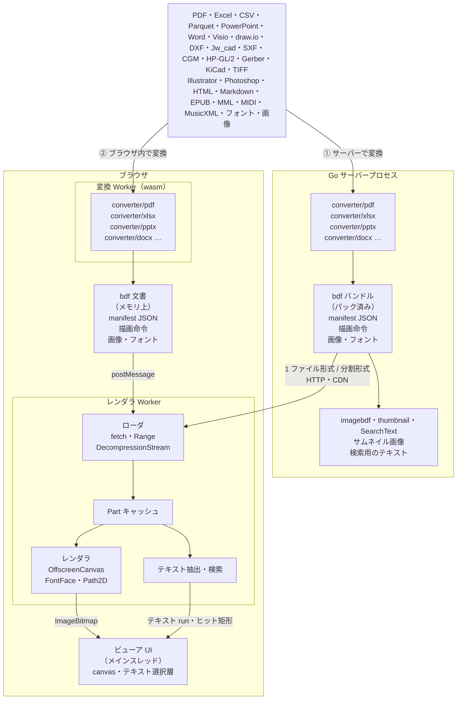

# 処理の流れ

経路は 2 つありますが、どちらも同じ BDF の Part を作り、同じレンダラで描画します。

## ① サーバーで変換

Go のサーバープロセス内で `converter/pdf`、`converter/pptx`、`converter/xlsx` などのパッケージが元ファイルを変換し、manifest・描画命令・画像・フォントをパックした **BDF バンドル**にします。配信の形は 2 つです。1 ファイル形式（先頭からのストリーミング読み、または Range による Part 単位の取得）か、オブジェクトストレージや CDN にそのまま置ける分割形式です。ブラウザでは、Worker 内のレンダラが必要な Part だけを読み込んで `OffscreenCanvas` に描画します。メインスレッドがすることは、受け取ったビットマップと透明なテキスト層を配置するだけです。

バンドルと一緒に、文書の一覧や検索エンジンが必要とするものも作れます。ただし、作るのは文書（パスワード付きの入力ならパスワードも）を持っている間だけです。Go のラスタライザ（`imagebdf`、`thumbnail`）で描いたサムネイル画像と、文書のメタデータ・ページごとのテキストの JSON（`Document.SearchText`）です。実際に動くサーバーの例は[構成のサンプル](../examples/index.ja.md)を参照してください。

## ② ブラウザ内で変換

同じ変換パッケージを wasm にしたもの（`cmd/bdfwasm`）が Worker で動き、ユーザーが開いたファイルをメモリ上の BDF 文書に変換して、そのままレンダラに渡します。変換から描画までがブラウザ内で完結し、ファイルは外に出ません。[デモサイト](https://shibukawa.github.io/bdf/)はこの経路で動いています。Office 系の変換器は、サイトと一緒に公開したフリーフォントでテキストをレイアウトします（文書が使うものだけを取得します）。

PDF はページ単位で変換します（`converter.OpenStream`）。ビューアはまずすべてのページの大きさを受け取ってから、表示中のページを優先して変換できたページの中身を順に受け取ります。最後に、完成した文書と差し替えます。ビューアと Worker の組み立て方は[ブラウザ側](browser.ja.md)を、Go・TypeScript の API は [BDF コマンド](cli.ja.md)や [API 一覧](../api.md)を参照してください。

## 次に読むもの

- **[フォルダ構成](layout.ja.md)** — 各ディレクトリに何が入っているか
- **[bdf コマンド](cli.ja.md)** — CLI のサブコマンドを順に説明
- **[ブラウザ側](browser.ja.md)** — Worker、ビューア、wasm の変換モジュール
- **[変換と出力](conversion.ja.md)** — 数式、楽譜と演奏、メタデータ、サーバー側のサムネイルと検索用テキスト
- **[パスワードと保護モード](protection.ja.md)** — パスワード付きの入力と暗号化、ログインした読者に数ページずつ封印して渡す保護モード
- **[ビルドとテスト](development.ja.md)** — Go・TypeScript のテストの実行、フィクスチャと golden の再生成
