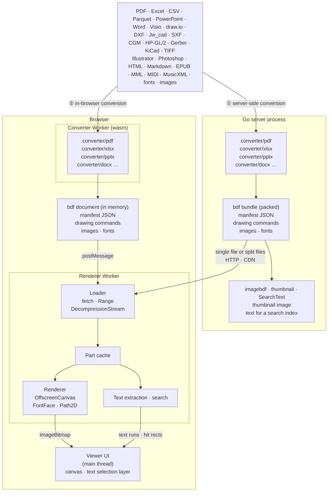

# How it works

This project takes two different paths to conversion, but both produce the same BDF parts and share the same renderer.

## ① Server-side conversion

Packages such as `converter/pdf`, `converter/pptx` and `converter/xlsx` run inside a Go server process and convert the source into a **BDF bundle** that packs the manifest, the drawing commands, the images and the fonts. That bundle goes out in one of two shapes: as a single file, streamed from the start or fetched part by part with Range requests, or as split files that can sit on object storage or a CDN as they are. In the browser, the renderer in a Worker loads only the parts it needs and draws them onto an `OffscreenCanvas`. The main thread only places the resulting bitmaps and a transparent text layer.

Next to the bundle, the server can also make what a document list and a search engine need — but only while it still holds the document, and, for a password-protected input, the password: a thumbnail image drawn by the Go rasterizer (`imagebdf`, `thumbnail`), and the text of each page with the document's metadata as JSON (`Document.SearchText`). See [Sample architectures](../examples/index.md) for two working servers built this way.

## ② In-browser conversion

The same converter packages, built as WebAssembly (`cmd/bdfwasm`), run in a Worker and convert the file the reader opened into a BDF document in memory, which goes straight to the renderer. Conversion and rendering both finish inside the browser and the file never leaves it. The [demo site](https://shibukawa.github.io/bdf/) works this way; the Office converters lay text out with free fonts published alongside the site, fetched only when a document uses them.

A PDF converts a page at a time (`converter.OpenStream`). The viewer gets every page's size up front, then each page's content as it finishes converting — the pages in view first — and swaps in the finished document once every page is done. See [In the browser](browser.md) for how the viewer and its workers are put together, and [The BDF command](cli.md) / the [API reference](../api.md) for the Go and TypeScript surfaces used on either path.

## Next

- **[Repository layout](layout.md)** — what's under each directory
- **[The bdf command](cli.md)** — the CLI's subcommands, walked through
- **[In the browser](browser.md)** — workers, the viewer, and the wasm converter modules
- **[Conversion and output](conversion.md)** — formulas, scores and playback, metadata, server-side thumbnails and search text
- **[Passwords and protected mode](protection.md)** — password-protected input and encryption, and protected mode, which hands a logged-in reader a few sealed pages at a time
- **[Building and testing](development.md)** — running the Go and TypeScript test suites, regenerating fixtures and goldens
