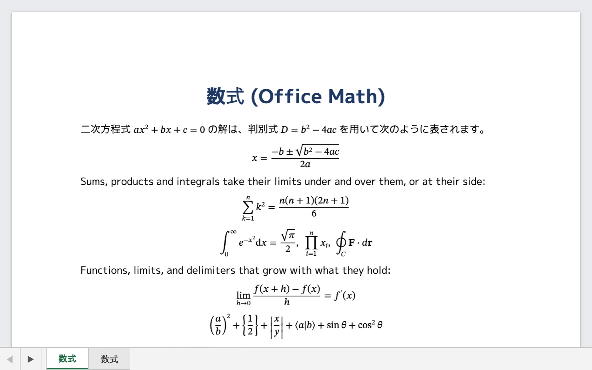

# Word・HTML・Markdown

Word の文書、HTML のページ、Markdown の文書は、どれも行・段落・表・ページに組む文章です。BDF はこの 3 つを別々の変換器で組むのではなく、1 つのレイアウトエンジン（`converter/internal/wordproc`。EPUB とも共有）で組みます。BDF 自体には再レイアウトの機能がなく、ビューアが描く行送りやページ送りは変換器が決めたものそのままです。つまり各変換器は、Word やブラウザがファイルを開くたびにやり直している組版を、1 度だけ済ませておきます。

## 試してみる

[ビューア](https://shibukawa.github.io/bdf/viewer/)にファイルをドロップするか、サンプルを試してください。[Word の文書](https://shibukawa.github.io/bdf/viewer/?file=samples/basic.docx)、同じ種類の文書を[日本語の縦書きにしたもの](https://shibukawa.github.io/bdf/viewer/?file=samples/vertical.docx)、[リーダー表示の HTML 記事](https://shibukawa.github.io/bdf/viewer/?file=samples/article.html)、[Markdown のファイル](https://shibukawa.github.io/bdf/viewer/?file=samples/basic.md)です。数式のサンプルは [Word](https://shibukawa.github.io/bdf/viewer/?file=samples/math.docx)、[HTML（MathML）](https://shibukawa.github.io/bdf/viewer/?file=samples/math.html)、[Markdown（LaTeX）](https://shibukawa.github.io/bdf/viewer/?file=samples/math.md) にあります。

## Word .docx（`converter/docx`）

`converter/docx` は `.docx` を読み、WordprocessingML を変換器自身が組みます。これは Word がファイルを開くたびに行っている行分割とページ分割の処理そのものです。行分割（和文の禁則とアキ、タブとリーダー、両端揃え、文書グリッド）、箇条書きと段落番号、表（表スタイル、セルの結合、ページをまたぐ行の分割、見出し行の繰り返し）、文字列の折り返しを伴う浮動する図とテキストボックス、段組み、セクション、ページ番号付きのヘッダー・フッター、脚注、東アジアの縦書き（漢字・仮名の正立、縦書き用の句読点、回転した欧文や表）、数式（Office Math）を扱います。

1 つの文書から View が 2 つ出てきます。紙面のページ（ヘッダー・本文・フッターのレイヤーを持つ flow View）と、同じ段落と表を本文の幅でもう一度、ページを持たない 1 本の長い列に組み直した View です。これは Word の下書き・Web レイアウト表示と同じ考え方で、フォントと画像はページの View と共有し、二重には持ちません。図は PowerPoint と同じ DrawingML の描画で描き、フォントも同じ方法で埋め込みます。

| オプション | 値 | 既定 |
|---|---|---|
| `-param views=` | `both`、`pages`、`scroll` | `both`（ページと scroll View の両方） |

詳細は[design.md §3.9](../design.md#39-word--bdf-変換器converterdocxの構造)を参照してください。

## HTML .html / .xhtml / .mhtml（`converter/html`）

`converter/html` はブラウザのリーダー表示のようにページを組みます。作者の CSS は捨て、Word の変換器が使うのと同じレイアウトエンジンで、要素を固定のスタイルシートで組み直します。記事は go-readability（Mozilla の Readability の Go への移植）で Web ページから取り出し、見出し・段落・リスト・引用・コード・表（セルの結合と内容に合わせた列幅）・図・リンク・MathML の数式を、Word の文書と同じように組みます。BDF は再レイアウトしないので、結果は決まった幅の scroll View になります（既定は本文の 36 字分。`-param views=pages` で A4 のページも作れます）。画像はページの隣のファイル、MHTML の中、`data:` URL、ネットワーク（既定で取得。`-param remote=false` で取らない）から読みます。SVG（`.svg` ファイルとページ内の `<svg>` 要素の両方）はそのまま格納してビューアが描き、大きさはブラウザと同じ規則で決まります。フォントは埋め込みません。名前で参照するので、ビューアは Web ページと同じく自身のフォントで文字を描きます（`-fonts embed` でサブセットを埋め込みます）。

| オプション | 値 | 既定 |
|---|---|---|
| `-param extract=` | `auto`、`article`、`none` | `auto`（記事らしいページだけ取り出す） |
| `-param views=` | `scroll`、`pages`、`both` | `scroll` |
| `-param width=` | scroll View のテキスト幅（ポイント） | 本文の 36 字分 |
| `-param size=` | 文字の大きさ（ポイント） | `12` |
| `-param font=` | 本文のフォントファミリー | インストールされているサンセリフ体 |
| `-param mono=` | コードのフォントファミリー | インストールされている等幅体 |
| `-param remote=` | `true`、`false` | `true`（ネットワークから画像を取得する） |
| `-param base=` | 文書の取得元 URL（相対リンクと画像の基準にする） | — |

詳細は[design.md §3.16](../design.md#316-htmlmarkdown--bdf-変換器converterhtmlconvertermarkdownの構造)を参照してください。

## Markdown .md（`converter/markdown`）

`converter/markdown` は goldmark で文書を HTML にし（CommonMark と GitHub の拡張の表・タスクリスト・取り消し線・自動リンク、脚注、定義リスト）、`converter/html` がページを組むのと同じ方法で組みます。ファイル全体が内容なので、記事を取り出す処理はしません。README によくある raw HTML（`<p align="center">`、`<details>`）もそのまま一緒に組み、見出しには GitHub と同じ id が付くので、見出しへのリンクはそのまま効きます。数式は GitHub と同じ書き方（`$…$`、`$$…$$`、```` ```math ```` のコードブロック）で LaTeX を書きます。YAML または TOML の front matter は文書の Dublin Core メタデータになります。

| オプション | 値 | 既定 |
|---|---|---|
| `-param views=` | `scroll`、`pages`、`both` | `scroll` |
| `-param width=` | scroll View のテキスト幅（ポイント） | 本文の 36 字分 |
| `-param size=` | 文字の大きさ（ポイント） | `12` |
| `-param font=` | 本文のフォントファミリー | インストールされているサンセリフ体 |
| `-param mono=` | コードのフォントファミリー | インストールされている等幅体 |
| `-param remote=` | `true`、`false` | `true`（ネットワークから画像を取得する） |
| `-param base=` | 文書の取得元 URL（相対リンクと画像の基準にする） | — |

詳細は[design.md §3.16](../design.md#316-htmlmarkdown--bdf-変換器converterhtmlconvertermarkdownの構造)を参照してください。HTML と Markdown の変換器は、Markdown をこのレイアウトの手前で HTML にしてしまうため、design.md でも 1 つの節を共有しています。

## 数式

Word の Office Math、HTML の MathML、Markdown の LaTeX は、同じ数式エンジンが数式フォント（STIX Two Math、Cambria Math など OpenType MATH のフォント）で組みます。行の中の数式は行の高さを広げて置き、独立した数式は中央に置いた段落になります。検索とコピーでは `x=(−b±√(b^2−4ac))/(2a)` のような線形表記のテキストになります。



**Word** — 「挿入 → 数式」で入れた数式（`m:oMath`、`m:oMathPara`）を読みます。分数、添字、根号、総和や積分、極限、伸びる括弧、行列、`&` で揃えた数式、アクセントを扱います。フォントは文書の指定（既定は Cambria Math）で、なければ STIX Two Math などで代えます。

```xml
<m:oMath>
  <m:r><m:t>x=</m:t></m:r>
  <m:f>
    <m:num><m:r><m:t>−b±</m:t></m:r><m:rad><m:radPr><m:degHide m:val="1"/></m:radPr><m:deg/><m:e><m:r><m:t>b²−4ac</m:t></m:r></m:e></m:rad></m:num>
    <m:den><m:r><m:t>2a</m:t></m:r></m:den>
  </m:f>
</m:oMath>
```

**HTML** — `math` 要素（Presentation MathML）を読みます。`display="block"` は独立した行です。KaTeX・MathJax・Wikipedia のページは、独自の描画の横に置かれた MathML から組みます。

```html
<p>円の面積は <math><mi>A</mi><mo>=</mo><mi>π</mi><msup><mi>r</mi><mn>2</mn></msup></math> です。</p>
<math display="block">
  <munderover><mo>∑</mo><mrow><mi>n</mi><mo>=</mo><mn>1</mn></mrow><mi>∞</mi></munderover>
  <mfrac><mn>1</mn><msup><mi>n</mi><mn>2</mn></msup></mfrac>
  <mo>=</mo>
  <mfrac><msup><mi>π</mi><mn>2</mn></msup><mn>6</mn></mfrac>
</math>
```

**Markdown** — GitHub と同じ書き方の LaTeX です。`$…$` は行の中、`$$…$$` と言語 `math` のコードブロックは独立した行になります。amsmath・amssymb の命令（`\frac`、`\sqrt`、`\left`…`\right`、`pmatrix`、`cases`、`aligned` など）が使えます。

````markdown
二次方程式 $ax^2 + bx + c = 0$ の解は

$$
x = \frac{-b \pm \sqrt{b^2 - 4ac}}{2a}
$$

```math
\int_{-\infty}^{\infty} e^{-x^2}\,dx = \sqrt{\pi}
```
````

サンプルは [`converter/docx/testdata/math.docx`](https://github.com/shibukawa/bdf/blob/main/converter/docx/testdata/math.docx)、[`converter/html/testdata/math.html`](https://github.com/shibukawa/bdf/blob/main/converter/html/testdata/math.html)、[`converter/markdown/testdata/math.md`](https://github.com/shibukawa/bdf/blob/main/converter/markdown/testdata/math.md) にあります。数式だけを組んで画像や Ebitengine の画面に描く方法は[描画する](../rendering.ja.md#数式を描く)を参照してください。
