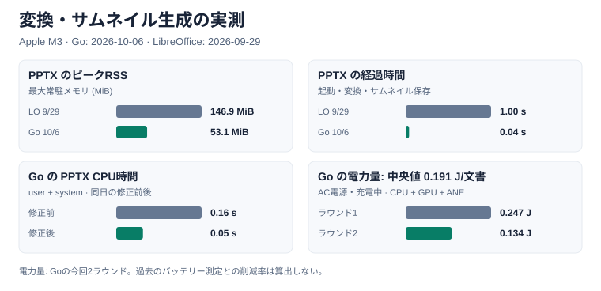

# なぜ bdf か

## メモリ・CPU・消費電力の実測

同じ Apple M3 の Mac で、Office ファイルの変換と 256 px の先頭ページサムネイル生成を測定しました。Go 側は 2026-10-06 の改善後の値、LibreOffice → PDF → Poppler は 2026-09-29 の保存済み値です。

| 入力 | ピークRSS: LibreOffice / Go (MiB) | 経過時間: LibreOffice / Go (秒) | GoのCPU時間 (秒) |
|---|---:|---:|---:|
| 小さい DOCX | 161.9 / 70.1 | 0.73 / 0.05 | 0.06 |
| 小さい PPTX | 146.9 / 53.1 | 1.00 / 0.04 | 0.05 |
| 小さい XLSX | 123.8 / 53.1 | 0.64 / 0.04 | 0.05 |
| 合成 XLSX（4シート×3,000行） | 289.7 / 52.6 | 1.55 / 0.38 | 0.46 |
| 合成 PPTX（100スライド） | 未計測 / 41.7 | 未計測 / 0.16 | 0.22 |

RSS はプロセスの最大常駐メモリ、経過時間は起動・変換・サムネイル保存を含む実時間です。CPU時間は user + system の合計で、経過時間やCPU使用率とは異なります。Go はウォームアップ後の5回の中央値。LibreOffice の合成 XLSX は3回、それ以外は5回です。出力形式と表示結果は異なります。[測定条件と改善内容](process-memory-review.ja.md)、[最新の時間・メモリ・CPUデータ](benchmarks/2026-10-06-go-optimized.json)、[9/29の比較データ](benchmarks/2026-09-29.json)を参照してください。

Go の最新の推定 SoC 電力量は **0.191 J/文書**（2ラウンド: 0.247、0.134 J/文書）でした。今回は **AC電源・充電中**、9/29 の Go 1.246 J/文書と LibreOffice 2.972 J/文書はバッテリー駆動です。電源条件が異なるため、この値から電力量の削減率は算出していません。測定は CPU・GPU・ANE の推定値で、端末全体の電力量ではありません。[電力量データ](benchmarks/2026-10-06-go-power.json)と[再計測スクリプト](../tools/benchmark-power.py)を公開しています。

## オフィススイートを動かさなくてよい

Office のファイルをブラウザでプレビューするには、サーバーで LibreOffice や OpenOffice をヘッドレスで動かして PDF にするのが定番です。プロセスの起動・維持・隔離も必要で、壊れたファイル 1 つでプロセスが詰まることもあります。

bdf の変換器は cgo も外部プログラムも使わない Go のパッケージで、[下の表](#対応形式)の多くの形式を 1 つのバイナリで変換します。同じコードを WebAssembly にすればブラウザの中でも変換でき（PDF 用が gzip で約 7.3 MB、Office 系・draw.io・CAD・KiCad・フォント用が約 7.8 MB）、ファイルをアップロードする必要すらありません。サムネイルと検索用のテキストも同じプロセスで作れます。ページを描くのは純 Go のラスタライザで、サーバー側にもブラウザは要りません。

## 必要な変換器だけを選んで組み込める

形式はたくさんありますが、全部を抱える必要はありません。変換器は形式ごとに独立した Go のパッケージで、import されたときに自分の形式を登録します。PDF と Office の文書だけを扱うサービスなら `converter/pdf`、`converter/docx`、`converter/xlsx`、`converter/pptx` だけを import すれば、バイナリにリンクされるのもそれだけです（全部入りは `converter/all`）。ブラウザ用の WebAssembly も、PDF 用、Office 系・CAD・KiCad・音楽・フォント用、HTML・Markdown・EPUB 用、画像用とビルドタグで分かれていて、ページは開いたファイルに要るモジュールだけを取得します。

## 内容に合った形で見せる

PDF はすべてを紙に切り分けます。スプレッドシートを印刷したページでは、横に長い表がページをまたいで分断されて行を追えず、目当てのセルも見つけにくくなります。固定した見出しや枠線は消え、ブックの中で切り替えていたシートは一続きのページになります。Word の文書もページ単位でしか読めません。

bdf は内容の種類ごとに、3 つのレイアウトモデルを使い分けます。

- **固定サイズのページ** — スライド、図面、PDF、アートボード。ページごとに決まった大きさを持ちます。
- **無限平面** — ワークシート。タイルで描き、ウィンドウ枠の固定、行・列見出し、枠線がつきます。シートが印刷ページに切り分けられることはありません。
- **フロー** — ワープロ文書。ページとしても一続きのスクロールとしても読め、本文の幅で 1 本の長い列に組み直した、ページのない表示も持てます。

1 つの文書は複数の View を持てます。ブックのシート、draw.io の図のページ、DXF のモデル空間とレイアウト、KiCad の回路図のシートと基板の各層はそれぞれ 1 つの View になり、ビューアは表計算ソフトのシートタブのようなタブで切り替えます。文書から別の View へのリンク（`#view=ID`）も張れます。draw.io のページから別のページへ、KiCad の階層シートから親シートへ、といった具合です。

## 対応形式

似た性質の形式はまとめて 1 行にしています。拡張子は主なものだけで、すべての拡張子と変換のオプションは[対応形式](formats/index.ja.md)の各ページにあります。

| 形式と主な拡張子 | 表示 | 特徴 |
|---|---|---|
| **文書と本** [PDF](formats/pdf.ja.md)、[EPUB](formats/ebook.ja.md) <small>.pdf、.epub</small> | ページ。本は見開きで開いてめくる | PDF は埋め込みフォントとタグ付き PDF の構造を保つ。EPUB はリフロー型（和文の縦書きも）を本のページに組み、固定レイアウトのマンガは 1 枚ずつのページに |
| **文章** [Word、HTML、Markdown](formats/document.ja.md) <small>.docx、.html、.mhtml、.md</small> | ページ、または一続きのスクロール | 1 つの組版エンジンで組む。縦書き、数式。HTML はリーダー表示 |
| **スライド** [PowerPoint](formats/presentation.ja.md) <small>.pptx</small> | ページ | マスターとレイアウト、表、グラフ、SmartArt、数式 |
| **表** [Excel、CSV・TSV、Apache Parquet](formats/spreadsheet.ja.md) <small>.xlsx、.csv、.tsv、.parquet</small> | シート（無限平面）。シートはタブで | ウィンドウ枠の固定、行・列見出し、条件付き書式。セルを選んで表計算ソフトに貼り付けられる |
| **図** [Visio、draw.io](formats/diagram.ja.md) <small>.vsdx、.vdx、.drawio（図を埋め込んだ .svg、.png も）</small> | ページ。ページはタブで | 背景ページとレイヤー、ページ間のリンク、AWS などのアイコン |
| **CAD の図面とプロット** [AutoCAD DXF、Jw_cad、SXF、CGM、HP-GL/2](formats/cad.ja.md) <small>.dxf、.jww、.p21、.sfc、.cgm、.plt</small> | ページ。モデル空間とレイアウトはタブで | 画層・線種・線の太さをプロッタが描くとおりに |
| **電子回路** [KiCad、Gerber・Excellon](formats/electronics.ja.md) <small>.kicad_sch、.kicad_pcb、.kicad_pro、.gbr、.drl、それらの ZIP</small> | ページ。回路図のシート、基板の表・裏・各層はタブで | 基板は基材・銅箔・マスク・シルク・穴の実物の見た目で。階層シートのリンク |
| **デザインと画像** [Illustrator](formats/pdf.ja.md)、[Photoshop、TIFF、Windows メタファイル、画像](formats/image.ja.md) <small>.ai、.psd、.psb、.tif、.emf、.wmf、.png、.jpg、.svg など</small> | ページ。アートボードごとに 1 ページ | 画像はデコードせずそのまま格納。SVG は拡大してもぼけない |
| **楽譜** [MML、MIDI、MusicXML](formats/music.ja.md) <small>.mml、.mid、.kar、.musicxml、.mxl</small> | ページ（五線譜） | ビューアで演奏し、演奏している段をカーソルで追う |
| **フォント** [TrueType、OpenType、WOFF](formats/font.ja.md) <small>.ttf、.otf、.ttc、.woff、.woff2</small> | スクロール。概要・文字・グリフ・フィーチャーはタブで | 文字とグリフの一覧、OpenType フィーチャーが実際にすること |

パスワード付きの Office 文書と PDF も変換でき、出力は同じパスワードで暗号化します（[パスワードと保護モード](architecture/protection.ja.md)）。どの形式も同じレンダラで描くので、この下に挙げるページめくり、検索、読み上げは形式を問わず同じように働きます。

## ページを読む、めくる

デモビューアはページをスクロールで並べるほか、1 ページずつ、または見開き（左開き・右開き）で表示して、本のようにめくれます。ページは、キー、ページボタン、タップ（綴じ目の先なら次へ、手前なら前へ）、ページの角や外側の端のドラッグでめくれ、めくる動きは WebGL で描きます（前後のページを先にテクスチャとして描いておきます）。システムが視差効果を減らす設定なら、アニメーションなしで切り替わります。めくる途中でなければ、ページの中のテキストはいつでも選択できます。

右綴じの本（`direction: "rtl"`。縦書きの日本語、右から読むマンガ）は右から左へめくり、EPUB は最初から見開きで開きます（`?layout=pages`・`single`・`spread`・`spread-rtl` で最初からその表示にできます）。楽譜はビューアで演奏でき、演奏している段にカーソルを示して、それに合わせてページをめくり、スクロールします。

## 検索と選択

文字は画像に焼き込んでいません。ページの絵の上に、同じ位置・同じ幅で透明なテキストを重ねています。

- **ビューアの全文検索**は Worker の中で文書全体を探します。行をまたいでも見つかり、NFKC とかなの正規化で、全角と半角、ひらがなとカタカナの違いを越えて見つけ、すべてのヒットの矩形を返します。
- **ブラウザ自身のページ内検索**（Ctrl+F・⌘F）も、表示しているページの文字を見つけます。
- **テキスト選択とコピー**は、テキストの層が持つ目印から空白と改行を復元します。ページをまたいでも、連続スクロールの表示でも働きます。
- **表のセルはセル単位で選べます**。あるセルから別のセルへドラッグすると、その間の矩形のセルが選ばれます。シート（Excel、CSV、Parquet）は表計算ソフトと同じように、ドラッグ、Shift、行・列の見出し、矢印キーで選べます。コピーするとタブ区切りの値と HTML の表をクリップボードに置くので、表計算ソフトには画像ではなくセルとして貼り付けられます。

## アクセシビリティ

構造の層が、見出し・リスト・表・代替テキスト付きの図・リンク・言語をスクリーンリーダーに伝えます。これはタグ付き PDF、PowerPoint と Word の構造、Excel・CSV・Parquet のセルと表の見出し、HTML・Markdown・EPUB の要素から変換したものです。Windows のハイコントラスト表示でも透明な文字が描画に重ならず、ページはキーボードでめくれます。

## ブラウザ表示に特化している

命令セットは Canvas 2D と 1 対 1 に対応します。フォントは `FontFace` に渡す WOFF2、画像はブラウザがデコードできる形式で、Part の圧縮は `DecompressionStream` で展開できる形式です。pdf.js のような PDF ビューアが数万行かけて実装しているフォントのラスタライズ、画像のデコード、展開はブラウザに任せ、bdf のデコーダとレンダラは TypeScript で約 3,400 行です（レンダラの Worker は gzip で 21 KB）。描画は Worker の `OffscreenCanvas` で行い、メインスレッドはビットマップを置くだけです。Part は内容アドレスなので、マスターや繰り返し現れる要素は 1 度だけ格納され、ビューアは表示中のページに要る Part だけを Range リクエストや CDN 上の分割形式から取得します。ブラウザ内で変換する PDF は、表示中のページを優先して変換できたページから表示します。

各変換器が何を保ち、どうレイアウトするかは[対応形式](formats/index.ja.md)を、変換と描画がどうつながっているかは[アーキテクチャ](architecture/index.ja.md)を参照してください。
