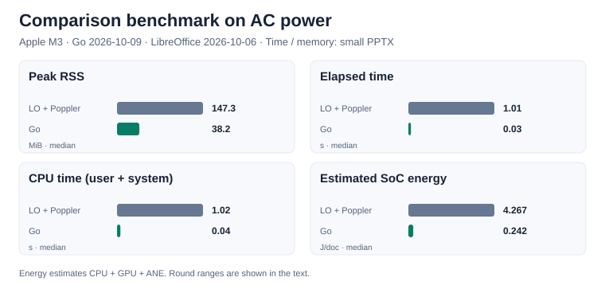

# Why BDF

## Measured memory, CPU time, and energy

Go and LibreOffice → PDF → Poppler were remeasured on the same Apple M3 Mac on AC power. Each workflow converts an Office file and creates a 256 px first-page thumbnail. Go was remeasured on 2026-10-09; the LibreOffice / Poppler values are from 2026-10-06.

| Input | RSS: LibreOffice / Go (MiB) | Elapsed: LibreOffice / Go (s) | CPU: LibreOffice / Go (s) |
|---|---:|---:|---:|
| Small DOCX | 161.8 / 43.4 | 0.69 / 0.05 | 0.67 / 0.06 |
| Small PPTX | 147.3 / 38.2 | 1.01 / 0.03 | 1.02 / 0.04 |
| Small XLSX | 123.7 / 36.0 | 0.65 / 0.04 | 0.63 / 0.04 |
| Synthetic XLSX (4 sheets × 3,000 rows) | 288.3 / 48.7 | 1.55 / 0.23 | 1.62 / 0.30 |
| Synthetic PPTX (100 slides) | 1918.9 / 40.8 | 56.38 / 0.12 | 68.30 / 0.19 |

Time and memory are medians of 5 runs after warmup. RSS is peak resident memory; CPU time is user + system; elapsed time includes startup, conversion, and output. LibreOffice and Poppler run sequentially, so their pipeline peak is the larger stage peak and their times are added. Output formats and visual results differ.

Estimated SoC energy: LibreOffice **4.267 J/document** (round range 3.295–7.155), Go **0.242 J/document** (0.241–0.248). Both workflows used AC power for 3 rounds.

See the [latest results and conditions](benchmarks/latest.json) and [measurement procedure](process-memory-review.ja.md). Raw logs stay in the local results directory outside Git.

## No office suite to run

Previewing an Office file in a browser usually means running LibreOffice or OpenOffice headless on a server and converting it to PDF. A headless office suite needs a process to start, keep alive, and isolate — one malformed file can wedge it.

BDF's converters are Go packages that use no cgo and no external program, and [the many formats in the table below](#formats) all convert in one binary. Built as WebAssembly, the same code converts inside the browser too — gzipped, about 7.3 MB for the PDF module and about 7.8 MB for the Office/CAD/KiCad/font module — so a file never has to leave the browser at all. Thumbnails and search text come from the same process. Pages are drawn by a pure-Go rasterizer; no browser is needed on the server either.

## Only the converters you need

There are many formats, but you don't have to carry them all. Each converter is a Go package of its own that registers its format when it is imported. A service that handles only PDF and Office documents imports `converter/pdf`, `converter/docx`, `converter/xlsx` and `converter/pptx`, and only those are linked into its binary (`converter/all` brings in every format). The WebAssembly modules for the browser are split by build tags the same way — PDF; the Office, CAD, KiCad, music and font formats; HTML, Markdown and EPUB; images and audio files — and a page fetches only the module the file it opens needs.

## In the shape of the content

A PDF cuts everything into sheets of paper. Print a spreadsheet and a wide table is sliced across page boundaries, so you lose the row you were following and can't find the cell you wanted; frozen headers and gridlines disappear, and the sheets you switched between in the workbook become one run of pages. A Word document is stuck reading page by page too.

BDF has three layout models, one for each kind of content:

- **Fixed pages** — slides, drawings, PDFs, artboards: a fixed size per page.
- **An endless plane** — worksheets: drawn in tiles, with frozen panes, row and column headers, and gridlines. A sheet is never cut into printed pages.
- **Flow** — word processor documents: pages you can read as pages or as one continuous scroll, plus a page-free view laid out again as one long column at the body's width.

A document can hold several views. A workbook's sheets, a draw.io diagram's pages, a DXF drawing's model space and layouts, and a KiCad project's schematic sheets and board layers each become one view, and the viewer switches between them with tabs, like a spreadsheet's sheet tabs. A document can also link from one view into another (`#view=ID`) — a draw.io page linking to another page, a KiCad hierarchical sheet linking to its parent.

## Formats

Formats with much in common share a row. Only the main extensions are listed; every extension and each converter's options are on the [Formats](formats/index.md) pages.

| Formats and main extensions | Shown as | What stands out |
|---|---|---|
| **Documents and books** [PDF](formats/pdf.md), [EPUB](formats/ebook.md) <small>.pdf, .epub</small> | Pages; a book opens as a spread whose pages turn | PDF keeps its embedded fonts and the structure of tagged PDF. EPUB lays reflowable books (Japanese vertical text too) out as book pages, and fixed-layout manga as one picture a page |
| **Text** [Word, HTML, Markdown](formats/document.md) <small>.docx, .html, .mhtml, .md</small> | Pages, or one continuous scroll | One layout engine for all three; vertical text, formulas; HTML in reader mode |
| **Slides** [PowerPoint](formats/presentation.md) <small>.pptx</small> | Pages | Masters and layouts, tables, charts, SmartArt, formulas |
| **Tables** [Excel, CSV/TSV, Apache Parquet](formats/spreadsheet.md) <small>.xlsx, .csv, .tsv, .parquet</small> | Sheets (an endless plane), sheets as tabs | Frozen panes, row and column headers, conditional formatting; cells select and paste into a spreadsheet as cells |
| **Page layout** [InDesign](formats/layout.md) <small>.idml</small> | Pages; a document opens as a spread in its binding direction | Stories flow through threaded frames across pages, master pages, Japanese vertical text; placed images given with the document |
| **Diagrams** [Visio, draw.io](formats/diagram.md) <small>.vsdx, .drawio (and SVG, PNG exports with the diagram embedded)</small> | Pages, pages as tabs | Background pages and layers, links between pages, AWS and other icon sets |
| **CAD drawings and plots** [AutoCAD DXF, Jw_cad, SXF, CGM, HP-GL/2](formats/cad.md) <small>.dxf, .jww, .p21, .sfc, .cgm, .plt</small> | Pages; model space and layouts as tabs | Layers, linetypes and lineweights resolved the way a plotter draws them |
| **Electronics** [KiCad, Gerber and Excellon](formats/electronics.md) <small>.kicad_sch, .kicad_pcb, .kicad_pro, .gbr, .drl, or those zipped</small> | Pages; schematic sheets, the board's front, back and each layer as tabs | Boards drawn as they look — substrate, copper, mask, silkscreen, holes; links between hierarchical sheets |
| **Design and images** [Illustrator](formats/pdf.md), [Photoshop, TIFF, Windows metafiles, images](formats/image.md) <small>.ai, .psd, .psb, .tif, .emf, .wmf, .png, .jpg, .svg and more</small> | Pages, one per artboard | Images stored as they are, never decoded; SVG stays sharp at any zoom |
| **Scores** [MML, MIDI, MusicXML](formats/music.md) <small>.mml, .mid, .kar, .musicxml, .mxl</small> | Pages (staff notation) | The viewer plays them, with a cursor on the system playing |
| **Audio** [MP3, M4A, FLAC, Ogg, WAV, AIFF](formats/audio.md) <small>.mp3, .m4a, .aac, .flac, .ogg, .opus, .wav, .aiff</small> | One page: a card | The cover art, the tags, the lyrics and chapters; the thumbnail is the cover, the tags are the metadata |
| **Fonts** [TrueType, OpenType, WOFF](formats/font.md) <small>.ttf, .otf, .ttc, .woff, .woff2</small> | Scroll; overview, characters, glyphs and features as tabs | Every character and glyph, and what each OpenType feature actually does |

Password-protected Office documents and PDFs convert too, and the output is encrypted with the same password ([Passwords and protected mode](architecture/protection.md)). Every format is drawn by the same renderer, so the page turning, search and reading aloud below work the same way for all of them.

## Reading pages, or turning them

The demo viewer lays pages out in a scroll, or shows them one at a time or as a spread (two pages side by side, left- or right-bound) and turns them like a book's. A page turns with the keyboard, the page buttons, a tap (past the spine goes forward, before it goes back), or by dragging a page's corner or outer edge, drawn in WebGL with the facing pages rendered ahead as textures. If the system asks to reduce motion, pages change without the animation. Unless a page is mid-turn, its text can be selected.

Right-bound books (`direction: "rtl"` — vertical Japanese text, manga read right to left) turn right to left, and EPUB opens as a spread from the start (`?layout=pages`, `single`, `spread` or `spread-rtl` picks the layout up front). Scores play in the viewer, with a cursor on the system playing, turning pages or scrolling to follow it.

## Search and selection

The text is not burned into a picture. Over the picture of a page lies transparent text at the same places and widths.

- **The viewer's full-text search** runs over the whole document in a worker, across line breaks, with NFKC and kana normalization (full width and half width, hiragana and katakana find each other), and returns the rectangles of every hit.
- **The browser's own find in page** (Ctrl+F, ⌘F) finds the words of the pages shown, too.
- **Selecting and copying** rebuilds spaces and line breaks from the text layer's own markers, across pages and in the continuous layout too.
- **Table cells select as cells**: drag from one cell to another and the rectangle between them is selected. Sheets (Excel, CSV, Parquet) select cells the way a spreadsheet does — drag, Shift, row and column headers, arrow keys — and copying puts them on the clipboard as tab-separated values and an HTML table, so they paste into a spreadsheet as cells, not as a picture.

## Accessibility

A structural layer tells screen readers about headings, lists, tables, figures with alt text, links and language. It is converted from tagged PDF, PowerPoint's and Word's structure, Excel/CSV/Parquet cells and table headers, and HTML, Markdown and EPUB elements. In Windows high contrast mode the transparent text stays off the drawing, and pages turn with the keyboard.

## Made for browsers

The instruction set maps one to one onto Canvas 2D. Fonts are WOFF2 for `FontFace`, images are in whatever format the browser can decode itself, and a Part's compression is what `DecompressionStream` can inflate. Font rasterization, image decoding and decompression — the tens of thousands of lines a PDF viewer like pdf.js reimplements — are left to the browser, so BDF's decoder and renderer are about 3,400 lines of TypeScript (the renderer's worker is 21 KB gzipped). Drawing happens on an `OffscreenCanvas` in a Worker; the main thread only places the bitmap. Parts are content-addressed, so a master or a repeated element is stored once, and the viewer fetches only the Parts a visible page needs — by range request, or from a split layout on a CDN. A PDF converted in the browser is drawn page by page as it converts, the visible page first.

See [Formats](formats/index.md) for what each converter keeps and how it lays its input out, and [Architecture](architecture/index.md) for how conversion and rendering fit together.
